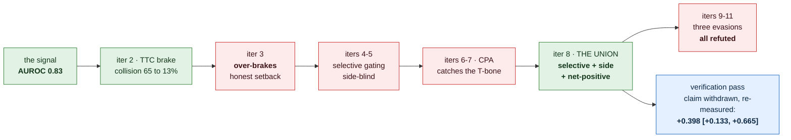
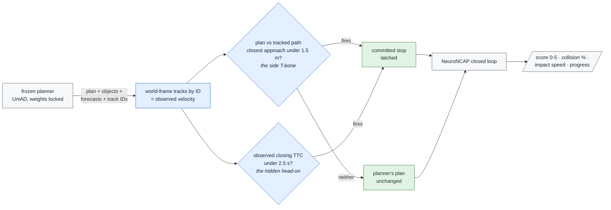
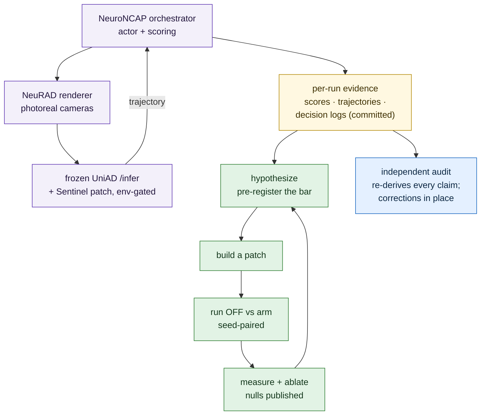

# Sentinel

**A runtime introspective safety monitor that watches a frozen self-driving planner, predicts the
collision it is about to cause, and intervenes — measured where it actually matters: in closed
loop, by whether the car crashes *and whether it can still drive*.**

> **Honest status up front (11 iterations + an independent verification pass):** the introspective
> signal predicts the planner's collisions (AUROC 0.83), and the best configuration — the **union**
> (iter 8) — is **selective** (clean-scene behaviour identical to the unmonitored planner),
> **removes most side-impacts** (100% → 30% at 20 unique episodes), **mitigates** the frontal
> head-on, and is **net-positive on the deployment metric with a bootstrap CI that excludes zero**
> (safe-progress +0.398, 95% CI [+0.133, +0.665], n=20 unique episodes/scene). That last sentence
> earned its precision the hard way: an independent verification pass
> ([`experiments/VERIFICATION.md`](experiments/VERIFICATION.md)) **withdrew** an earlier version of
> it — the original pooling had counted NeuroNCAP's deterministic per-index episodes as independent
> replications — and the claim was then **re-established on 20 genuinely-unique episodes**, with
> run indices 0–7 doubling as an exact-reproduction check of the whole apparatus (they match to
> the last digit). Three evasive designs to *prevent* the head-on were honestly **refuted** — the
> last showing *why*: a swerve on a false alarm crashes, and the fresh n=20 re-check confirms it.
> Over-claims here get caught by our own audits and corrected in place — that self-correction is
> the point. Full arc in [Status](#status--where-it-really-stands-the-honest-current-truth).

The field's open-loop driving metrics are saturated and gameable (an ego-state MLP "wins" nuScenes
L2). The honest axis is **closed-loop safety**, and there the public state of the art is wide open:
the strongest end-to-end planners **collide in 87.8–99.6% of safety-critical scenarios** and score
**1.84 (UniAD) / 2.75 (VAD) out of 5** on NeuroNCAP. Sentinel attacks that gap with a small,
plug-and-play monitor on a *frozen* planner — no fleet, no retraining the planner, single-digit
GPUs.

> Built on what we already proved. In a prior study ([PerceptionProof](https://github.com/manfromnowhere143/perceptionproof))
> a cheap label-free signal predicted the **collision gate at AUROC ~0.8**. Sentinel takes that
> introspective signal **closed-loop, with intervention, to prevent the crash** — the natural
> sequel: *we showed cheap signals see failure coming; now we use them to stop it.*

---

## The result

Eleven iterations under a frozen campaign pre-registration converge on one configuration — the
**union** — that, on a frozen UniAD planner, is **selective, side-impact-reducing, and
net-positive over the unmonitored planner** on a progress-aware deployment metric. The numbers
below are the verification pass's definitive fresh measurement: **20 genuinely-unique episodes per
scene per arm**, seed-paired, with run indices 0–7 doubling as an exact reproduction of the
original iteration-8 data (they match to the last digit):

| metric (20 unique episodes/scene) | unmonitored planner | Sentinel (union) |
|---|---:|---:|
| clean-scene score / collision (selectivity) | 4.51 / 10% | **4.51 / 10%** (identical) |
| side-impact collision rate | **100 %** | **30 %** |
| frontal head-on score (0–5) | 0.84 | **2.36** (impact mitigated) |
| **safe-progress** (safety × route progress) | 1.83 | **2.22** |

> **Net-positive, on statistics that survived an adversarial audit:** safe-progress advantage
> **+0.398, 95 % CI [+0.133, +0.665]** — excludes zero at n=20 unique episodes. An earlier version
> of this claim was **withdrawn** by the independent verification pass (it had pooled
> deterministic episode replays as if independent — [`experiments/VERIFICATION.md`](experiments/VERIFICATION.md))
> and re-established on fresh data. The other honest limit, named precisely: the frontal head-on
> is *mitigated*, not *prevented*, and three evasive designs to prevent it were tested and refuted
> (§Status) — the third refutation re-confirmed at n=20.

In the units an AV safety case is written in (derived from the committed per-frame decision logs
and ground-truth timing — [`analyze_safety_case.py`](experiments/verification/analyze_safety_case.py)):
the monitor fires a **median 2.5 s before counterfactual contact** (range 1.0–3.5 s), spends
**11 brake frames per 242 benign meters** driven on the clean scene, and cuts frontal mean impact
speed from **13.9 to 6.7 m/s**.

The campaign in one picture — every step measured closed-loop against the same unmonitored planner,
nulls kept, one headline withdrawn by our own audit and re-established on independent data:



The winning monitor is a **union of two individually-selective detectors**, chosen because the two
failure modes are physically distinct — a side T-bone is a real path crossing, while a head-on is
hidden by the planner's own optimism:

The planner's own `/infer` outputs — plan, detected objects, scores, persistent track IDs,
forecasts, ego pose — are the monitor's only inputs; nothing privileged. Object velocity is
*observed* (ego-motion-compensated tracking by ID across frames), not the planner's optimistic
forecast. The stop is latched, so it is safe even when the trigger is wrong. Every frame's decision
is written to a committed receipt log.



Neither detector fires on a benign passing object, so the union inherits both terms' selectivity; each
term catches the danger case the other is blind to. Full derivation — and the honest nulls along the
way — in the score tracker and [Status](#status--where-it-really-stands-the-honest-current-truth).

---

## The number we are chasing (pre-registered)

Primary benchmark: **NeuroNCAP** (public, NeRF/NeuRAD closed-loop on nuScenes). Metric: NeuroNCAP
**safety score (0–5, ↑)** and **collision rate (%, ↓)**. The win bar is frozen in
[`PREREGISTRATION.md`](PREREGISTRATION.md): a Sentinel-monitored frozen planner must beat **the same
unmonitored planner** (and a RiskMonitor-style baseline) with a bootstrap CI excluding zero.

### Score tracker (honest trajectory — updated every iteration)

| iter | what we changed | NeuroNCAP score ↑ | collision % ↓ | vs baseline | insight |
|---|---|---|---|---|---|
| 0 | published baseline (target) | UniAD 1.84 · VAD 2.75 | 87.8–99.6 | — | the gap we attack |
| 1a | **stack stood up** — full closed loop on 1 L4, frozen UniAD in the loop, real metric out (smoke: scene-0103 stationary, 2 runs → 5.0/5.0, no collision) | — | — | infra gate **cleared** | the binding constraint was the apparatus, not the idea — [8 blockers cleared](experiments/iter1_reproduce/PROOF_smoke_0103.md) |
| 1b | **partial baseline + collision corpus** — every public-mini scene, frozen UniAD, 60 closed-loop episodes (frontal/0103, side/0103, stationary/0103, stationary/0796 × 15) | frontal/0103 **1.07** · side/0103 0.51 · stat/0103 5.00 · stat/0796 1.03 | 80 · 100 · 0 · 80 % | frontal **1.07 vs pub 1.17** (matches) | crashes coincide with the planner's own perception collapsing at 5–15 m — the signal iter 2 monitors |
| 2·G1 | **monitor signal validated** — frozen planner's own forecasts foresee its crashes (shadow replay, 40 episodes, 26/14) | — | — | **AUROC 0.83** (label-free) | imminent (≤0.5 s) predicted gap is the signal; sharpens toward imminent (0.67→0.75→0.83 at the cited horizons, one small inversion mid-curve); simplest term wins |
| 2 | **monitor + TTC brake, frozen planner** — A/B on the corpus | **1.92 → 4.67** | **65% → 13%** | **H1 met** (safety), CI [+2.21,+3.22] | TTC trigger + committed stop; side collisions 100%→0% — *but see iter 3* |
| 2·abl | **ablation** — naive-proximity / always-brake controls | — | prox 83 · always 50 · TTC 40 (frontal) | introspective signal **essential** | naive distance brake ≈ useless on fast approaches; closing-speed-from-forecast does the work |
| 3 | **deployment metric (safe-progress)** — does it avoid the crash AND drive? | OFF **2.08** · always 0.49 · TTC 0.58 (safe-prog) | progress: OFF 0.91 · TTC 0.13 | **monitor over-brakes** | honest setback: TTC freezes benign scenes, *not* selective; unmonitored wins safe-progress. Next: introspective gating |
| 4 | **gate on the *agent's* closing speed** — brake only on active threats | gated **2.80** · OFF 2.08 · TTC-old 0.64 (safe-prog) | clean-scene progress restored to OFF (0 brakes) | **net-positive vs OFF** (partial) | selectivity SOLVED; but gate under-brakes real threats (optimistic-forecast velocity) → danger safety lost. Next: track true agent velocity |
| 5 | **observed-velocity gating** — agent velocity from multi-frame tracking, not the forecast | tracked **2.35** · OFF 2.08 (safe-prog) | clean=OFF (0 brakes); frontal coll 83%→**67%** | net-positive; **frontal recovered** | selectivity holds + observed velocity beats the forecast on frontal — but **side-impact still 100%** (its warning is in the ego's motion the gate filters out). Next: plan-vs-tracked-path collision check |
| 6 | **plan-vs-tracked-path CPA** — brake if the ego's planned path crosses an agent's tracked path | cpa 2.17 · OFF 2.32 (safe-prog) | **side-impact 100% → 0%** (8/8 avoided) | **side case SOLVED** (but over-brakes) | the T-bone that beat iters 4–5 is caught geometrically; cost = 2.5 m margin also flags benign close passes → clean 33→22 m. Next: tighter margin (~1.2 m) to keep the side win + restore selectivity |
| 7 | **margin sweep** — CPA at 1.5 m vs 1.0 m vs OFF | cpa@1.5 selective (clean 32.3 = OFF) | side **0%** kept; frontal reverts to **100%** | **3 of 4 at once** | tighter margin restores selectivity + keeps the side win, but frontal defeats plan-CPA at *any* tight margin (optimistic plan clears by 3–4 m). No single margin holds all four → **union two detectors** |
| 8 | **the union** — brake if (plan-vs-path CPA < 1.5 m) OR (observed agent-closing TTC < 2.5 s) | union **2.53** · OFF 2.32 (safe-prog) | clean 30.2≈OFF · **side 100→12.5%** (7/8, verification-corrected) · frontal score 1.31→**2.43** | **selective + side-solving + directionally net-positive, at once** | first config to hold 3 of 4 simultaneously; frontal impact strongly *mitigated* (not rate-reduced). Open ceiling: preventing (not softening) frontal head-on — planner optimism + stopping distance |
| 9 | **evasive steering (AES) for frontal** — threat-aware: side→stop, head-on→swerve | — | frontal evade **1.66/100%** vs union stop **2.53/83%** | **refuted (null)** | naive 4 m swerve can't clear the actor and, keeping speed, hits harder than stopping. Selectivity + side preserved. Committed stop stays best; frontal *prevention* remains open |
| 10 | **braking evasion into a tracked-clear gap** — shed speed *and* steer to the open side | — | frontal brakevade **1.67/100%** vs union stop **2.53/83%** | **refuted (null)** | second evasion family, same result: steering (even while braking) is worse than the pure stop. Two designs converge → committed stop is the frontal *ceiling*; prevention needs more than a single maneuver |
| ✓ | **statistical validation** — pool the union & OFF arms across iters 8/9/10, bootstrap the safe-progress delta | union 2.60 vs OFF 2.14 (pooled) | side "5%" (pooled) | *claimed* net-positive | **WITHDRAWN by the verification pass**: the three "replications" are deterministic replays of the same episodes (n=20 was really n=8 unique); honest CI [−0.27, +0.78] does not exclude 0. [`union_validation`](experiments/union_validation/RESULT.md) |
| 11 | **early collision-course detection + evasion** — 4 s kinematic closest-approach, then time-gated lane change | — | frontal evade **83%** (= stop 83%); clean **50% crash**; side evade 83% | **refuted (null)** | third evasion refuted, and complete-data audit made it stronger: early detection neither prevents the head-on nor stays selective; evasion on a false alarm *crashes the clean scene 50%* and un-solves the side case (83%). A stop is safe when wrong, a swerve is not. Frontal-prevention line closed. [`iter11_early_evade`](experiments/iter11_early_evade/RESULT.md) |
| ✚ | **independent verification pass** — re-derive every claim from raw evidence; attack the statistics; re-run fresh at 20 unique episodes | union **2.22** vs OFF 1.83 (n=20 unique) | side 100→**30%** · clean identical to OFF | **net-positive RE-ESTABLISHED**: delta **+0.398, 95% CI [+0.133, +0.665]** | determinism found (episodes replay per run index) → pooled claim withdrawn, then re-measured on 20 genuinely-unique episodes: CI excludes zero; runs 0-7 reproduce iteration 8 exactly (apparatus check); iter11 evasion null re-confirms (worse than stop, degrades the clean scene). Raw evidence committed. [`VERIFICATION.md`](experiments/VERIFICATION.md) |

> **Iteration 1a (2026-06-30):** the NeuroNCAP closed-loop apparatus runs end-to-end on a single GPU
> and produces the genuine per-run metric schema with a *frozen* planner — the engineering risk the
> pre-registration flagged is retired. Proof: [`PROOF_smoke_0103.md`](experiments/iter1_reproduce/PROOF_smoke_0103.md).
>
> **Iteration 1b (2026-06-30):** 60 closed-loop episodes on public-mini scenes. The single clean
> apples-to-apples point — **frontal/0103 = 1.07 vs the published 1.17** — reproduces within
> run-noise; the UniAD failure profile reproduces qualitatively (80–100 % collision in dynamic
> scenarios). Per-scene variance is huge (stationary 5.00 → 1.03), which is exactly why the *averaged*
> baseline needs the gated full trainval set, so no full-baseline claim is drawn here. The real
> payload is a **corpus of 39 frozen-planner collisions** for iteration 2, and a structured
> introspective signal (collisions track `recall@5-15m → 0`). Detail:
> [`PARTIAL_BASELINE.md`](experiments/iter1b_partial_baseline/PARTIAL_BASELINE.md).

---

## How it works — the Sentinel loop

A frozen planner proposes a plan; Sentinel reads the planner's own internal state, scores the risk
that this plan ends in a collision, and — above threshold — triggers a principled intervention
(brake / fallback). All evaluated in a public neural closed-loop simulator.

The apparatus is three public containers on one L4: the NeuroNCAP orchestrator drives the scenario
actor and scores collisions; NeuRAD renders photoreal multi-camera frames from real nuScenes
drives; the frozen UniAD container serves `/infer` with the Sentinel patch env-gated per arm.
Episodes are deterministic per run index (established by the verification pass), so every
comparison is seed-paired. Every run leaves evidence — scores, driven trajectories, per-frame
monitor decisions — which feeds both the research loop and the independent audit:



The monitor is small and the planner is frozen — that is what makes this winnable on single-digit
GPUs and what makes a win *defensible*: any safety gain is attributable to Sentinel, not to a
bigger planner. The label-free trigger reads only what the planner already outputs (its plan, its
detected objects, and their motion) — no ground truth, no privileged sim state. The *risk* term itself
evolved across iterations — from a time-to-collision scalar (iter 2) to a plan-vs-tracked-path
closest-approach test (iter 6); see the score tracker and Status for the honest trajectory.

## The research engine (how we get better every iteration)

Sentinel runs on a disciplined learning loop — hypothesize → build → **measure vs the baseline** →
**attribute (ablate *why*)** → improve — with the win bar frozen up front (`PREREGISTRATION.md`) and
drive-clustered bootstrap CIs on the deltas. The loop is working as intended: iteration 2 produced a
safety win, iteration 2's ablation flagged what the safety metric couldn't separate, and iteration 3
ran that experiment and **overturned an over-claim from iteration 2** — logged and corrected, not
buried. That self-correction is the point. Full design: [`docs/ARCHITECTURE.md`](docs/ARCHITECTURE.md)
(note: the Ed25519-receipt and seed-sweep machinery described there is design intent carried over from
[PerceptionProof](https://github.com/manfromnowhere143/perceptionproof); it is **not yet wired into the
Sentinel runs**, which is stated here rather than implied).

## Status — where it really stands (the honest current truth)

The full iteration-by-iteration arc — including the iteration-3 self-correction, the
selectivity/side-blindness trade of iterations 4–7, and the three refuted evasion designs — is
kept, with every number and link, in [`docs/CAMPAIGN.md`](docs/CAMPAIGN.md). The summary table
above is the same history in one screen.

**Net, stated plainly — eleven iterations plus an independent verification pass.** The **union
(iter 8) is the best monitor** of the campaign: selective (clean-scene behaviour identical to the
unmonitored planner at n=20), side-impact 100% → 30%, frontal *mitigated* (score 0.84 → 2.36), and
**net-positive on safe-progress with a CI that excludes zero** (+0.398, [+0.133, +0.665], 20
unique episodes/scene — re-established after the original pooled version was withdrawn by audit).
The frontal head-on *ceiling* is firmly established — a committed stop is the best frontal
response, and **three separate evasion designs (iters 9, 10, 11) were tested and honestly
refuted**, all worse than stopping, the last one dangerous on false alarms (re-confirmed at n=20:
25% clean-scene collisions vs OFF's 10%). Frontal head-on *prevention* is a genuinely hard open
problem, not a maneuver away — which is exactly what the introspective plan-selection line attacks
next.

**What's next.** With invented maneuvers exhausted for the frontal edge case, three lines remain —
one new mechanism and two scaling milestones:

- **Introspective plan selection (the active line).** Stop overriding the planner; **re-rank the
  frozen planner's own candidate trajectories** by the label-free risk score and execute the safest
  feasible one. Safe on false alarms *by construction* (every candidate is planner-generated and
  in-distribution — the iteration-11 false-alarm crash is structurally impossible), and the first
  mechanism with a credible path to *preventing* the head-on rather than softening it. Plan:
  [`docs/NEXT_FRONTIER_INTROSPECTIVE_PLAN_SELECTION.md`](docs/NEXT_FRONTIER_INTROSPECTIVE_PLAN_SELECTION.md).
- **A second frozen planner (VAD).** Does the union transfer beyond UniAD, or is it UniAD-specific? VAD
  exposes the identical output schema, so the monitor's logic is unchanged — the stack is built and the
  union is patched onto VAD; the one remaining step is generating VAD's NeuroNCAP-specific data-infos.
  Staged to a precise restart point: [`vad_generalization/STATUS.md`](experiments/vad_generalization/STATUS.md).
- **The full 14-scene benchmark.** All results here are on the 2 NeuroNCAP scenes present in public
  `v1.0-mini`; the averaged published number needs the gated ~290 GB trainval set (a free nuScenes
  account). That is the one dependency external to this repo.

Scope throughout, stated plainly: 2 public-mini scenes, single-digit-to-20 runs, one L4 — a
method-development loop on public data, **not** a claim against the full 14-scene published benchmark.

## Reproduce & repository map

**Every headline number regenerates from committed evidence — no GPU, no dataset download:**

```bash
python3 -m pytest -q                                   # monitor geometry unit tests (stdlib + pytest only)

# the G1 signal: AUROC 0.83 from the committed shadow dump
python3 experiments/iter2_monitor/g1_auroc.py \
        experiments/iter2_monitor/proof/risk.jsonl.gz \
        experiments/iter2_monitor/proof/outcomes.tsv

# the verification audit: determinism proof, side-impact recount, honest n=8 CI
python3 experiments/verification/audit_pooling.py

# the safety-engineering view: lead time, intervention budget, severity
python3 experiments/verification/analyze_safety_case.py

# the definitive n=20 measurement (+0.398, CI [+0.133, +0.665]) — committed output
cat experiments/verification/proof_v20.txt             # regenerate: analyze_v20.py (paths in header)
```

The closed-loop stack itself is three public Docker images (NeuRAD renderer · frozen planner ·
NeuroNCAP orchestrator/scorer) on a single L4; the monitor is a self-contained patch injected into
the planner's inference server, gated by environment variables so every arm (OFF / union / RSS /
ablations) is one switch. Each experiment directory is self-describing:

| path | what it holds |
|---|---|
| [`PREREGISTRATION.md`](PREREGISTRATION.md) · [`docs/ARCHITECTURE.md`](docs/ARCHITECTURE.md) | frozen win bar; research-loop design |
| [`experiments/iter1_reproduce/`](experiments/iter1_reproduce) · [`iter1b_partial_baseline/`](experiments/iter1b_partial_baseline) | stack stood up; baseline reproduced + collision corpus |
| [`experiments/iter2_monitor/`](experiments/iter2_monitor) | the signal (G1, AUROC 0.83), the first A/B, the ablation, and the corrected over-claim |
| [`experiments/iter3_progress/`](experiments/iter3_progress) | the deployment metric (safe-progress) — the honest setback |
| [`experiments/iter4_gated/`](experiments/iter4_gated) … [`iter7_margin/`](experiments/iter7_margin) | selectivity → observed velocity → CPA → margin sweep |
| [`experiments/iter8_union/`](experiments/iter8_union) | **the definitive monitor** (union of two detectors) |
| [`experiments/iter9_evade/`](experiments/iter9_evade) · [`iter10_brakevade/`](experiments/iter10_brakevade) · [`iter11_early_evade/`](experiments/iter11_early_evade) | three refuted evasion designs for frontal prevention (reported nulls) |
| [`experiments/union_validation/`](experiments/union_validation) | pooled bootstrap CI — **withdrawn** (invalid pooling); corrected in place |
| [`experiments/VERIFICATION.md`](experiments/VERIFICATION.md) · [`verification/`](experiments/verification) | **independent verification pass**: audit, corrections, committed raw evidence, fresh n=20 re-measurement, safety-case analysis |
| [`experiments/iter12_plan_selection/`](experiments/iter12_plan_selection) | **introspective plan selection** (active): pre-registered checkpoint + candidate logging |
| [`experiments/iter13_rss_baseline/`](experiments/iter13_rss_baseline) | **RSS-style formal-envelope baseline** (pre-registered, queued) |
| [`experiments/vad_generalization/`](experiments/vad_generalization) | second-planner generalization, staged |

Every result folder carries a `RESULT.md` with the real per-run numbers, the exact server patch, and the
run script. `sentinel/monitor.py` is the pure-geometry monitor with unit tests (`tests/`); CI runs ruff +
pytest on every push.

## Data & honesty

Public datasets only (nuScenes via NeuroNCAP); no fleet or proprietary data; no frames
redistributed. Published baselines are single-preprint and unreproduced — reproducing them is our
true starting line, and every null is reported, not buried.
