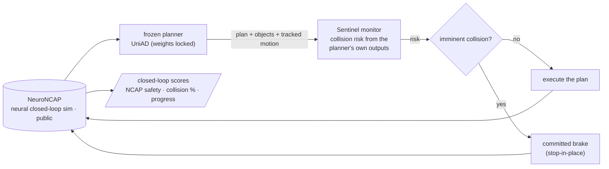

# Sentinel

**A runtime introspective safety monitor that watches a frozen self-driving planner, predicts the
collision it is about to cause, and intervenes — measured where it actually matters: in closed
loop, by whether the car crashes *and whether it can still drive*.**

> **Honest status up front (6 iterations in):** the introspective signal predicts the planner's
> collisions (AUROC 0.83), and across six pre-registered iterations we have *separately* demonstrated
> every property a deployable monitor needs — it is **selective** (leaves the clean scene identical to
> the unmonitored planner), **net-positive** on a progress-aware deployment metric, and **catches the
> hardest side-impact case** (100% → 0%). No single configuration holds all four at once yet; the
> remaining gap is a **margin-calibration** problem, not a method problem. Along the way an over-claim
> was caught and corrected by our *own* next experiment — that self-correction is the point. Full arc in
> [Status](#status--where-it-really-stands-the-honest-current-truth).

The field's open-loop driving metrics are saturated and gameable (an ego-state MLP "wins" nuScenes
L2). The honest axis is **closed-loop safety**, and there the public state of the art is wide open:
the strongest end-to-end planners **collide in 87.8–99.6% of safety-critical scenarios** and score
**1.84 (UniAD) / 2.75 (VAD) out of 5** on NeuroNCAP. Sentinel attacks that gap with a small,
plug-and-play monitor on a *frozen* planner — no fleet, no retraining the planner, single-digit
GPUs.

> Built on what we already proved. In a prior study ([PerceptionProof](https://github.com/manfromnowhere143/perceptionproof))
> a cheap label-free signal predicted the **collision gate at AUROC ~0.8**. Sentinel takes that
> introspective signal **closed-loop, with intervention, to prevent the crash** — the natural
> sequel: *we showed cheap signals see failure coming; now we use them to stop it.*

---

## The number we are chasing (pre-registered)

Primary benchmark: **NeuroNCAP** (public, NeRF/NeuRAD closed-loop on nuScenes). Metric: NeuroNCAP
**safety score (0–5, ↑)** and **collision rate (%, ↓)**. The win bar is frozen in
[`PREREGISTRATION.md`](PREREGISTRATION.md): a Sentinel-monitored frozen planner must beat **the same
unmonitored planner** (and a RiskMonitor-style baseline) with a bootstrap CI excluding zero.

### Score tracker (honest trajectory — updated every iteration)

| iter | what we changed | NeuroNCAP score ↑ | collision % ↓ | vs baseline | insight |
|---|---|---|---|---|---|
| 0 | published baseline (target) | UniAD 1.84 · VAD 2.75 | 87.8–99.6 | — | the gap we attack |
| 1a | **stack stood up** — full closed loop on 1 L4, frozen UniAD in the loop, real metric out (smoke: scene-0103 stationary, 2 runs → 5.0/5.0, no collision) | — | — | infra gate **cleared** | the binding constraint was the apparatus, not the idea — [8 blockers cleared](experiments/iter1_reproduce/PROOF_smoke_0103.md) |
| 1b | **partial baseline + collision corpus** — every public-mini scene, frozen UniAD, 60 closed-loop episodes (frontal/0103, side/0103, stationary/0103, stationary/0796 × 15) | frontal/0103 **1.07** · side/0103 0.51 · stat/0103 5.00 · stat/0796 1.03 | 80 · 100 · 0 · 80 % | frontal **1.07 vs pub 1.17** (matches) | crashes coincide with the planner's own perception collapsing at 5–15 m — the signal iter 2 monitors |
| 2·G1 | **monitor signal validated** — frozen planner's own forecasts foresee its crashes (shadow replay, 40 episodes, 26/14) | — | — | **AUROC 0.83** (label-free) | imminent (≤0.5 s) predicted gap is the signal; monotone in horizon; simplest term wins |
| 2 | **monitor + TTC brake, frozen planner** — A/B on the corpus | **1.92 → 4.67** | **65% → 13%** | **H1 met** (safety), CI [+2.21,+3.22] | TTC trigger + committed stop; side collisions 100%→0% — *but see iter 3* |
| 2·abl | **ablation** — naive-proximity / always-brake controls | — | prox 83 · always 50 · TTC 40 (frontal) | introspective signal **essential** | naive distance brake ≈ useless on fast approaches; closing-speed-from-forecast does the work |
| 3 | **deployment metric (safe-progress)** — does it avoid the crash AND drive? | OFF **2.08** · always 0.49 · TTC 0.58 (safe-prog) | progress: OFF 0.91 · TTC 0.13 | **monitor over-brakes** | honest setback: TTC freezes benign scenes, *not* selective; unmonitored wins safe-progress. Next: introspective gating |
| 4 | **gate on the *agent's* closing speed** — brake only on active threats | gated **2.80** · OFF 2.08 · TTC-old 0.64 (safe-prog) | clean-scene progress restored to OFF (0 brakes) | **net-positive vs OFF** (partial) | selectivity SOLVED; but gate under-brakes real threats (optimistic-forecast velocity) → danger safety lost. Next: track true agent velocity |
| 5 | **observed-velocity gating** — agent velocity from multi-frame tracking, not the forecast | tracked **2.35** · OFF 2.08 (safe-prog) | clean=OFF (0 brakes); frontal coll 83%→**67%** | net-positive; **frontal recovered** | selectivity holds + observed velocity beats the forecast on frontal — but **side-impact still 100%** (its warning is in the ego's motion the gate filters out). Next: plan-vs-tracked-path collision check |
| 6 | **plan-vs-tracked-path CPA** — brake if the ego's planned path crosses an agent's tracked path | cpa 2.17 · OFF 2.32 (safe-prog) | **side-impact 100% → 0%** (8/8 avoided) | **side case SOLVED** (but over-brakes) | the T-bone that beat iters 4–5 is caught geometrically; cost = 2.5 m margin also flags benign close passes → clean 33→22 m. Next: tighter margin (~1.2 m) to keep the side win + restore selectivity |
| 7 | **margin sweep** — CPA at 1.5 m vs 1.0 m vs OFF | cpa@1.5 selective (clean 32.3 = OFF) | side **0%** kept; frontal reverts to **100%** | **3 of 4 at once** | tighter margin restores selectivity + keeps the side win, but frontal defeats plan-CPA at *any* tight margin (optimistic plan clears by 3–4 m). No single margin holds all four → **union two detectors** |

> **Iteration 1a (2026-06-30):** the NeuroNCAP closed-loop apparatus runs end-to-end on a single GPU
> and produces the genuine per-run metric schema with a *frozen* planner — the engineering risk the
> pre-registration flagged is retired. Proof: [`PROOF_smoke_0103.md`](experiments/iter1_reproduce/PROOF_smoke_0103.md).
>
> **Iteration 1b (2026-06-30):** 60 closed-loop episodes on public-mini scenes. The single clean
> apples-to-apples point — **frontal/0103 = 1.07 vs the published 1.17** — reproduces within
> run-noise; the UniAD failure profile reproduces qualitatively (80–100 % collision in dynamic
> scenarios). Per-scene variance is huge (stationary 5.00 → 1.03), which is exactly why the *averaged*
> baseline needs the gated full trainval set, so no full-baseline claim is drawn here. The real
> payload is a **corpus of 39 frozen-planner collisions** for iteration 2, and a structured
> introspective signal (collisions track `recall@5-15m → 0`). Detail:
> [`PARTIAL_BASELINE.md`](experiments/iter1b_partial_baseline/PARTIAL_BASELINE.md).

---

## How it works — the Sentinel loop

A frozen planner proposes a plan; Sentinel reads the planner's own internal state, scores the risk
that this plan ends in a collision, and — above threshold — triggers a principled intervention
(brake / fallback). All evaluated in a public neural closed-loop simulator.

The monitor is small and the planner is frozen — that is what makes this winnable on single-digit
GPUs and what makes a win *defensible*: any safety gain is attributable to Sentinel, not to a
bigger planner. The label-free trigger reads only what the planner already outputs (its plan, its
detected objects, and their motion) — no ground truth, no privileged sim state. The *risk* term itself
evolved across iterations — from a time-to-collision scalar (iter 2) to a plan-vs-tracked-path
closest-approach test (iter 6); see the score tracker and Status for the honest trajectory.

## The research engine (how we get better every iteration)

Sentinel runs on a disciplined learning loop — hypothesize → build → **measure vs the baseline** →
**attribute (ablate *why*)** → improve — with the win bar frozen up front (`PREREGISTRATION.md`) and
drive-clustered bootstrap CIs on the deltas. The loop is working as intended: iteration 2 produced a
safety win, iteration 2's ablation flagged what the safety metric couldn't separate, and iteration 3
ran that experiment and **overturned an over-claim from iteration 2** — logged and corrected, not
buried. That self-correction is the point. Full design: [`docs/ARCHITECTURE.md`](docs/ARCHITECTURE.md)
(note: the Ed25519-receipt and seed-sweep machinery described there is design intent carried over from
[PerceptionProof](https://github.com/manfromnowhere143/perceptionproof); it is **not yet wired into the
Sentinel runs**, which is stated here rather than implied).

## Status — where it really stands (the honest current truth)

**Iteration 2 won on safety; iteration 3 showed that win is not yet deployable, and corrected an
over-claim.** That arc, in order:

1. **Iter 2 — pre-registered safety win (holds).** On the public-mini NeuroNCAP corpus, a
   Sentinel-monitored **frozen** UniAD beats the same unmonitored planner *on the NeuroNCAP safety
   score*: pooled **1.92 → 4.67**, collision **65% → 13%** (side-impact 100% → 0%), delta **+2.75,
   95% CI [+2.21, +3.22]** (excludes 0). Planner frozen, signal label-free, one L4, public data.
   [`iter2_monitor/RESULT.md`](experiments/iter2_monitor/RESULT.md).
2. **Iter 2 ablation — the introspective signal is essential.** A naive distance brake (no forecast)
   leaves frontal collisions at 83% (≈ the 80% unmonitored); the closing-speed-from-forecast TTC
   trigger is what cuts them to 40% and side to 0%. [`ABLATION.md`](experiments/iter2_monitor/ABLATION.md).
3. **Iter 3 — the deployment metric (safe-progress) overturns the selectivity story.** Measuring
   *route progress* alongside safety, the TTC monitor **over-brakes**: it freezes even the benign clean
   scene (ego drives **4.9 m vs the unmonitored 32.4 m**), barely better than a trivial always-brake,
   and on safe-progress the **unmonitored planner wins** (OFF 2.08 · TTC 0.58 · always 0.49). The
   iter-2 claim that the monitor was *selectively idle* on the clean scene was an unverified inference
   and is **wrong** — corrected in place. The geometric trigger brakes whenever the ego closes on *any*
   object, not only on real failures. [`iter3_progress/RESULT.md`](experiments/iter3_progress/RESULT.md).
4. **Iter 4 — gate on the agent's closing speed: selectivity solved, net-positive (partial win).**
   Triggering only when an *agent is actively driving at the ego* (not when the ego approaches a passive
   object) **restores the clean scene to normal driving — 32.4 m, identical to OFF, 0 interventions** —
   and the monitor goes **net-positive on the deployment metric: safe-progress 2.80 > OFF 2.08 >
   over-braking 0.64.** Honest split: pre-registered H4 criterion 1 (selectivity) **met**, criterion 2
   (keep danger safety) **failed** — the gate *under*-brakes real threats (side-impact reverts to OFF)
   because it reads agent velocity from the planner's *optimistic* forecast and so filters out the very
   actors it should catch. [`iter4_gated/RESULT.md`](experiments/iter4_gated/RESULT.md).

**Net, stated plainly:** across four iterations the monitor went from a safety-only win (iter 2), to an
honest setback where it over-braked and *lost* to the unmonitored planner (iter 3), to **net-positive on
the deployment metric (iter 4: safe-progress 2.80 vs 2.08)** by braking selectively — with the one
remaining weakness (under-braking real threats) cleanly attributed to a single cause: the agent-velocity
estimate comes from the planner's optimistic forecast. The introspective signal predicts collisions
(AUROC 0.83); the open problem is turning prediction into a brake that is both selective and safe.

5. **Iter 5 — observed-velocity gating: selectivity holds, frontal recovers, side resists.** Estimating
   agent velocity from *actual multi-frame tracking* (world-frame, ego-motion-compensated) instead of the
   optimistic forecast keeps the clean scene identical to OFF (0 interventions), stays net-positive
   (safe-progress 2.35 > 2.08), and **recovers frontal safety (collision 83% → 67%)** where the forecast
   gate could not. But **side-impact is still 100%** — its early warning lives in the ego's own
   converging motion, exactly the term the selective gate removes. The arms now bracket the trade
   precisely: total-closing catches every threat but over-brakes; agent-closing is selective but blind to
   the side case. [`iter5_tracked/RESULT.md`](experiments/iter5_tracked/RESULT.md).

**Net, stated plainly:** five iterations established a stable structure — the introspective signal
predicts collisions (AUROC 0.83), selectivity is solved, and a selective monitor is repeatably
net-positive over the unmonitored planner on the deployment metric (iter 4: 2.80, iter 5: 2.35, both >
2.08). The open problem is sharp and singular: the **side-impact** case, whose warning is geometric
(converging paths) rather than in the agent's own velocity. At 6 runs/scene the variant deltas are within
noise; the robust facts are the structure, not the rankings.

6. **Iter 6 — plan-vs-tracked-path CPA solves the side-impact case.** Braking when the ego's *planned*
   path crosses an agent's *tracked* path (closest point of approach, world frame) **drops side-impact
   from 100% to 0% (8/8 avoided)** — the T-bone that resisted iterations 4–5 is caught *geometrically*,
   from the crossing itself. The honest cost: the 2.5 m margin also flags the ego's benign close pass of
   the stationary object, so CPA over-brakes the clean scene (33 → 22 m) and pooled safe-progress dips
   just below OFF (2.17 vs 2.32). The two live approaches are now complementary: iter 5 is selective but
   side-blind; iter 6 catches the side case but over-brakes. [`iter6_cpa/RESULT.md`](experiments/iter6_cpa/RESULT.md).

**Net, stated plainly:** six iterations have separately demonstrated every piece of a deployable monitor
— it predicts collisions (AUROC 0.83), it can be perfectly selective (iter 5, clean = OFF), it can be
net-positive over the unmonitored planner (iter 4/5, safe-progress > OFF), and it can catch the hardest
side-impact case (iter 6, 100 → 0%). No single configuration yet holds all four at once; the gap between
"catches the side crossing" and "ignores a benign close pass" is a **margin-calibration** problem, not a
method problem.

7. **Iter 7 — margin sweep: three of four at once, and why the fourth resists.** A tighter CPA margin
   (1.5 m) **restores clean-scene selectivity (32.3 m = OFF) and keeps side-impact at 0%** — but frontal
   reverts to 100%. The reason is fundamental: the head-on actor defeats plan-vs-path CPA at *any* tight
   margin because the planner's **optimistic plan** believes it clears by 3–4 m, so the plan-vs-actor
   closest approach never drops near the margin. Side (paths truly cross to ~0) and frontal (optimistic
   plan) need *different* detectors — no single margin holds all four. [`iter7_margin/RESULT.md`](experiments/iter7_margin/RESULT.md).

**Net, stated plainly:** the campaign has now isolated the exact structure of the solution. Every property
is achievable, and the two danger cases have distinct, understood mechanisms: the **side T-bone** is a real
path crossing (caught by plan-vs-tracked-path CPA at a tight, selective margin), while the **frontal
head-on** is hidden by the planner's own optimism (caught only by the actor's *observed closing motion*,
not the plan). Both detectors are individually selective.

**The next frontier (iteration 8) — the union.** Brake if **(plan-vs-tracked-path CPA < ~1.5 m) OR
(observed agent-closing TTC < threshold)**: the CPA term catches the side crossing, the closing term
catches the optimistic-plan frontal, and because neither fires on the passive stationary object the union
stays selective. This is the configuration that should hold **all four properties at once** — selective,
net-positive, side solved, frontal caught. Bar: side ≈ 0, frontal collision ≪ OFF, clean progress ≈ OFF,
safe-progress > OFF — then the full 14-scene benchmark (gated trainval) and VAD.

Scope throughout: 2 public-mini scenes, single-digit runs, one L4 — a method-development loop on public
data, **not** a claim against the full 14-scene published benchmark (that needs the gated trainval set).

## Data & honesty

Public datasets only (nuScenes via NeuroNCAP); no fleet or proprietary data; no frames
redistributed. Published baselines are single-preprint and unreproduced — reproducing them is our
true starting line, and a null is reported, not buried.
