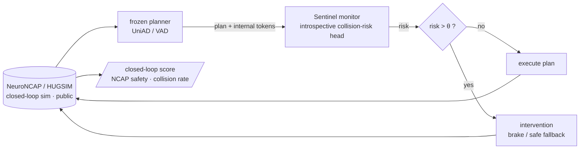

# Sentinel

**A runtime introspective safety monitor that watches a frozen self-driving planner, predicts the
collision it is about to cause, and intervenes — measured where it actually matters: in closed
loop, by whether the car crashes.**

The field's open-loop driving metrics are saturated and gameable (an ego-state MLP "wins" nuScenes
L2). The honest axis is **closed-loop safety**, and there the public state of the art is wide open:
the strongest end-to-end planners **collide in 87.8–99.6% of safety-critical scenarios** and score
**1.84 (UniAD) / 2.75 (VAD) out of 5** on NeuroNCAP. Sentinel attacks that gap with a small,
plug-and-play monitor on a *frozen* planner — no fleet, no retraining the planner, single-digit
GPUs.

> Built on what we already proved. In a prior study ([PerceptionProof](https://github.com/manfromnowhere143/perceptionproof))
> a cheap label-free signal predicted the **collision gate at AUROC ~0.8**. Sentinel takes that
> introspective signal **closed-loop, with intervention, to prevent the crash** — the natural
> sequel: *we showed cheap signals see failure coming; now we use them to stop it.*

---

## The number we are chasing (pre-registered)

Primary benchmark: **NeuroNCAP** (public, NeRF/NeuRAD closed-loop on nuScenes). Metric: NeuroNCAP
**safety score (0–5, ↑)** and **collision rate (%, ↓)**. The win bar is frozen in
[`PREREGISTRATION.md`](PREREGISTRATION.md): a Sentinel-monitored frozen planner must beat **the same
unmonitored planner** (and a RiskMonitor-style baseline) with a bootstrap CI excluding zero.

### Score tracker (honest trajectory — updated every iteration)

| iter | what we changed | NeuroNCAP score ↑ | collision % ↓ | vs baseline | insight |
|---|---|---|---|---|---|
| 0 | published baseline (target) | UniAD 1.84 · VAD 2.75 | 87.8–99.6 | — | the gap we attack |
| 1a | **stack stood up** — full closed loop on 1 L4, frozen UniAD in the loop, real metric out (smoke: scene-0103 stationary, 2 runs → 5.0/5.0, no collision) | — | — | infra gate **cleared** | the binding constraint was the apparatus, not the idea — [8 blockers cleared](experiments/iter1_reproduce/PROOF_smoke_0103.md) |
| 1b | **partial baseline + collision corpus** — every public-mini scene, frozen UniAD, 60 closed-loop episodes (frontal/0103, side/0103, stationary/0103, stationary/0796 × 15) | frontal/0103 **1.07** · side/0103 0.51 · stat/0103 5.00 · stat/0796 1.03 | 80 · 100 · 0 · 80 % | frontal **1.07 vs pub 1.17** (matches) | crashes coincide with the planner's own perception collapsing at 5–15 m — the signal iter 2 monitors |
| 2 | *monitor + intervention on the corpus* (next) | (pending) | (pending) | the actual method | — |

> **Iteration 1a (2026-06-30):** the NeuroNCAP closed-loop apparatus runs end-to-end on a single GPU
> and produces the genuine per-run metric schema with a *frozen* planner — the engineering risk the
> pre-registration flagged is retired. Proof: [`PROOF_smoke_0103.md`](experiments/iter1_reproduce/PROOF_smoke_0103.md).
>
> **Iteration 1b (2026-06-30):** 60 closed-loop episodes on public-mini scenes. The single clean
> apples-to-apples point — **frontal/0103 = 1.07 vs the published 1.17** — reproduces within
> run-noise; the UniAD failure profile reproduces qualitatively (80–100 % collision in dynamic
> scenarios). Per-scene variance is huge (stationary 5.00 → 1.03), which is exactly why the *averaged*
> baseline needs the gated full trainval set, so no full-baseline claim is drawn here. The real
> payload is a **corpus of 39 frozen-planner collisions** for iteration 2, and a structured
> introspective signal (collisions track `recall@5-15m → 0`). Detail:
> [`PARTIAL_BASELINE.md`](experiments/iter1b_partial_baseline/PARTIAL_BASELINE.md).

---

## How it works — the Sentinel loop

A frozen planner proposes a plan; Sentinel reads the planner's own internal state, scores the risk
that this plan ends in a collision, and — above threshold — triggers a principled intervention
(brake / fallback). All evaluated in a public neural closed-loop simulator.

The monitor is small and the planner is frozen — that is what makes this winnable on single-digit
GPUs and what makes a win *defensible*: any safety gain is attributable to Sentinel, not to a
bigger planner.

## The research engine (how we get better every iteration)

Sentinel runs on a disciplined learning loop — hypothesize → build → **measure vs the baseline** →
**attribute (ablate *why*)** → improve — with the number frozen up front, drive-clustered
bootstrap CIs, seed sweeps, and an Ed25519 receipt for every run. Nulls are logged and fed forward,
not buried. Full design: [`docs/ARCHITECTURE.md`](docs/ARCHITECTURE.md).

## Status

Pre-registration frozen; engine designed; target locked from a 110-agent adversarially-verified
frontier survey. **Iteration 1 = reproduce the published NeuroNCAP baseline** (the binding
constraint is infrastructure, not the idea). Then the monitor + intervention, and the score tracker
starts to climb.

## Data & honesty

Public datasets only (nuScenes via NeuroNCAP/HUGSIM); no fleet or proprietary data; no frames
redistributed. Published baselines are single-preprint and unreproduced — reproducing them is our
true starting line, and a null is reported, not buried.
