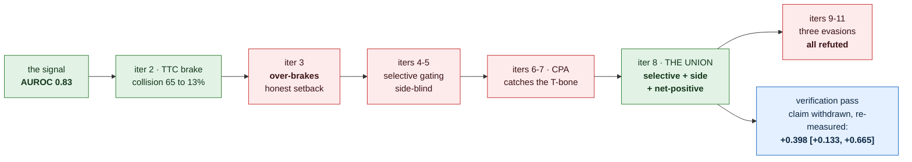
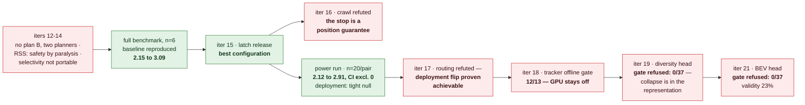
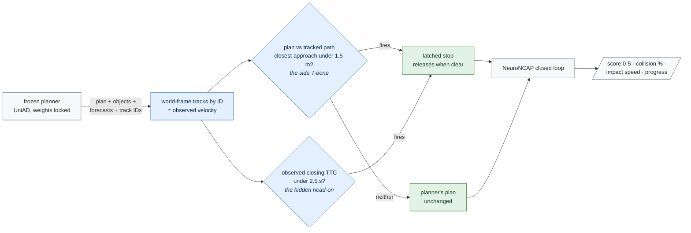
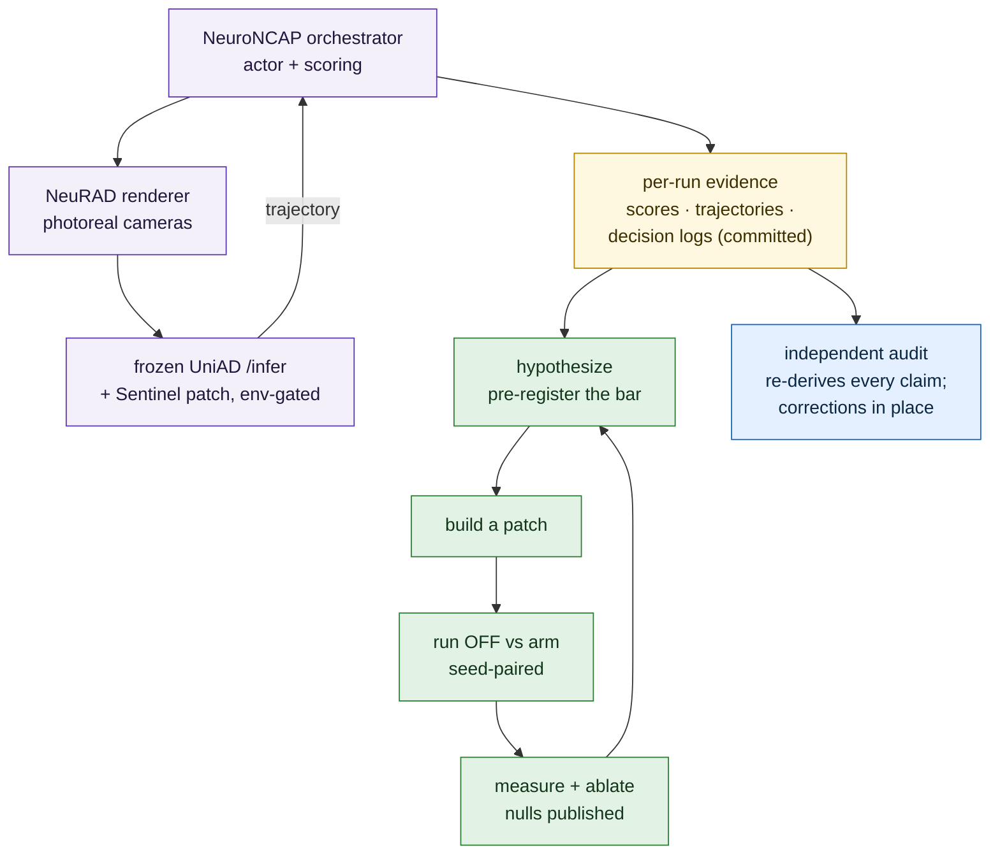

# Sentinel

**A runtime introspective safety monitor that watches a frozen self-driving planner, predicts the
collision it is about to cause, and intervenes — measured where it actually matters: in closed
loop, by whether the car crashes *and whether it can still drive*.**

> **Honest status up front (27 completed iterations + an independent verification pass + the
> full official benchmark at power + one active official data-staging pre-registration):** the introspective signal predicts the planner's collisions (AUROC 0.83). On the
> complete 14-scene NeuroNCAP set at **20 seed-paired runs per pair** (799 episodes, the power
> measurement), the unmonitored UniAD baseline **independently reproduces** (pooled 2.12 vs the
> published 1.84 — to the verified literature, a first), and the best configuration — the
> **released union** (iteration 8's two-detector union + iteration 15's threat-cleared latch
> release) — lifts the benchmark score to **2.91 (+0.783, 95% CI [+0.605, +0.928])**, with run
> indices 0–5 of every pair reproducing the earlier 6-run measurement exactly. Stated with equal
> weight: on this repository's own deployment metric (safety × progress) the effect vs the
> unmonitored planner is a **tight null (−0.03, 95% CI [−0.13, +0.07])** — the benchmark safety
> gain costs approximately nothing in deployment terms, and iteration 16 showed the residual
> cannot be bought back by softening the stop: a calibrated 2 m/s crawl recovers progress but
> surrenders the stop's **position guarantee** (side collisions past the pre-registered
> falsifier bar) — that null is published and the stop stands. The statistics here earned their precision the hard way: an
> independent verification pass ([`experiments/VERIFICATION.md`](experiments/VERIFICATION.md))
> **withdrew** an earlier headline — the original pooling had counted NeuroNCAP's deterministic
> per-index episodes as independent replications — and the claim was re-established on 20
> genuinely-unique episodes (+0.398, CI [+0.133, +0.665] at mini-scene scope), with run indices
> 0–7 doubling as an exact-reproduction check of the whole apparatus. Three evasive designs to
> *prevent* the head-on were honestly **refuted** — the last showing *why*: a swerve on a false
> alarm crashes. Over-claims here get caught by our own audits and corrected in place — that
> self-correction is the point. Full arc in
> [Status](#status--where-it-really-stands-the-honest-current-truth).

The field's open-loop driving metrics are saturated and gameable (an ego-state MLP "wins" nuScenes
L2). The honest axis is **closed-loop safety**, and there the public state of the art is wide open:
the strongest end-to-end planners **collide in 87.8–99.6% of safety-critical scenarios** and score
**1.84 (UniAD) / 2.75 (VAD) out of 5** on NeuroNCAP. Sentinel attacks that gap with a small,
plug-and-play monitor on a *frozen* planner — no fleet, no retraining the planner, single-digit
GPUs.

> Built on what we already proved. In a prior study ([PerceptionProof](https://github.com/manfromnowhere143/perceptionproof))
> a cheap label-free signal predicted the **collision gate at AUROC ~0.8**. Sentinel takes that
> introspective signal **closed-loop, with intervention, to prevent the crash** — the natural
> sequel: *we showed cheap signals see failure coming; now we use them to stop it.*

---

## The result

Twenty-six documented iterations under a frozen campaign pre-registration converge on one configuration — the
**released union** (two label-free geometric detectors + a threat-cleared latch release) —
measured on the **complete official 14-scene NeuroNCAP set at 20 seed-paired runs per pair**
(799 episodes; hypotheses frozen before the run; the first 6 indices of every pair reproduce the
earlier 6-run measurement exactly):

| pooled, all 14 official scenes (n=20/pair) | unmonitored UniAD | Sentinel (released union) |
|---|---:|---:|
| **NeuroNCAP score (0–5, the benchmark's metric)** | 2.12 *(published: 1.84 — reproduced)* | **2.91** |
| side-impact collision rate | 74% | **44%** |
| stationary collision rate | 29% | **18%** |
| frontal head-on | 1.24 / 78% | 1.78 / 90% (impact mitigated, not prevented) |
| safe-progress (safety × route progress) | 2.40 | 2.36 (−0.03, CI [−0.13, +0.07]) |

> **Benchmark score +0.783, 95% CI [+0.605, +0.928] — excludes zero at 3.3× the original
> power** — with the release mechanism strictly dominating the plain union (identical safety on
> every cell, safe-progress +0.246, CI [+0.206, +0.293] at n=6). The honest limits, named
> precisely: the frontal head-on is *mitigated*, not *prevented* (three evasive designs to
> prevent it were tested and refuted, §Status; the frontal/0346 regression is confirmed real at
> n=20); and the deployment-metric effect vs the unmonitored planner is a **tight null**
> (−0.03, CI [−0.13, +0.07]) — the safety gain costs approximately nothing on the deployment
> metric, and iteration 16 established the residual is not recoverable by softening the stop.

The verification pass's fresh mini-scene measurement stands as measured there: at **20
genuinely-unique episodes per scene** the union is net-positive on safe-progress **+0.398, 95% CI
[+0.133, +0.665]** — a claim that was first **withdrawn** by our own audit (the original pooling
had counted deterministic episode replays as independent —
[`experiments/VERIFICATION.md`](experiments/VERIFICATION.md)) and re-established on fresh data,
with run indices 0–7 doubling as an exact reproduction of the original iteration-8 data.

In the units an AV safety case is written in (derived from the committed per-frame decision logs
and ground-truth timing — [`analyze_safety_case.py`](experiments/verification/analyze_safety_case.py)):
the monitor fires a **median 2.5 s before counterfactual contact** (range 1.0–3.5 s), spends
**11 brake frames per 242 benign meters** driven on the clean scene, and cuts frontal mean impact
speed from **13.9 to 6.7 m/s**.

The campaign in one picture — every step measured closed-loop against the same unmonitored planner,
nulls kept, one headline withdrawn by our own audit and re-established on independent data:


```mermaid
flowchart LR
  G1["the signal<br/><b>AUROC 0.83</b>"] --> I2["iter 2 · TTC brake<br/>collision 65 to 13%"]
  I2 --> I3["iter 3<br/><b>over-brakes</b><br/>honest setback"]
  I3 --> I45["iters 4-5<br/>selective gating<br/>side-blind"]
  I45 --> I67["iters 6-7 · CPA<br/>catches the T-bone"]
  I67 --> U["iter 8 · THE UNION<br/><b>selective + side<br/>+ net-positive</b>"]
  U --> E9["iters 9-11<br/>three evasions<br/><b>all refuted</b>"]
  U --> V["verification pass<br/>claim withdrawn, re-measured:<br/><b>+0.398 [+0.133, +0.665]</b>"]
  classDef win fill:#e2f3e5,stroke:#2e7d32,color:#13361b;
  classDef bad fill:#fdebec,stroke:#c62828,color:#3b1213;
  classDef audit fill:#e4f0ff,stroke:#1565c0,color:#0c2742;
  class G1,I2,U win;
  class I3,I45,I67,E9 bad;
  class V audit;
```

Act two — from a validated method to the benchmark, at power, with the mechanism space mapped:


```mermaid
flowchart LR
  N12["iters 12-14<br/>no plan B, two planners ·<br/>RSS: safety by paralysis ·<br/>selectivity not portable"] --> F14["full benchmark, n=6<br/>baseline reproduced<br/><b>2.15 to 3.09</b>"]
  F14 --> R15["iter 15 · latch release<br/><b>best configuration</b>"]
  R15 --> X16["iter 16 · crawl refuted<br/><b>the stop is a<br/>position guarantee</b>"]
  R15 --> P20["power run · n=20/pair<br/><b>2.12 to 2.91, CI excl. 0</b><br/>deployment: tight null"]
  P20 --> X17["iter 17 · routing refuted —<br/><b>deployment flip proven<br/>achievable</b>"]
  X17 --> X18["iter 18 · tracker offline gate<br/><b>12/13 — GPU stays off</b>"]
  X18 --> H19["iter 19 · diversity head<br/><b>gate refused: 0/37</b> —<br/>collapse is in the<br/>representation"]
  H19 --> H21["iter 21 · BEV head<br/><b>gate refused: 0/37</b><br/>validity 23%"]
  classDef win fill:#e2f3e5,stroke:#2e7d32,color:#13361b;
  classDef bad fill:#fdebec,stroke:#c62828,color:#3b1213;
  classDef next fill:#f6f8fa,stroke:#57606a,color:#1f2328;
  class F14,R15,P20 win;
  class N12,X16,X17,X18 bad;
  class H19,H21 bad;
```

Act three — causal localization is now gated first on artifact validity:


```mermaid
flowchart LR
  H21["iter 21 null<br/>BEV head: 0/37<br/>validity 23%"] --> Q["question<br/>where does<br/>collapse become causal?"]
  Q --> F22["iter 22 S0 fail<br/>1,507 missing-GT joins<br/>heldout rows 0"]
  F22 --> I23["iter 23<br/>S0-hardened rerun"]
  I23 --> C23["canary pass<br/>deterministic join"]
  C23 --> S23["full S0 pass<br/>2,627/2,627 joins"]
  S23 --> L23["count-floor fail<br/>collapse 0 all splits<br/>heldout danger 17/30"]
  L23 --> N23["data-null published<br/>stop before probes"]
  N23 --> A24["iter 24<br/>fresh risk-support atlas"]
  A24 --> Z24["availability-null<br/>0 fresh eligible scenes<br/>582 candidates missing cameras"]
  classDef bad fill:#fdebec,stroke:#c62828,color:#3b1213;
  classDef ask fill:#fff8e1,stroke:#b28704,color:#3d2f00;
  classDef active fill:#e4f0ff,stroke:#1565c0,color:#0c2742;
  class H21,F22,L23,N23,Z24 bad;
  class Q ask;
  class I23,C23,S23,A24 active;
```

The winning monitor is a **union of two individually-selective detectors**, chosen because the two
failure modes are physically distinct — a side T-bone is a real path crossing, while a head-on is
hidden by the planner's own optimism:

The planner's own `/infer` outputs — plan, detected objects, scores, persistent track IDs,
forecasts, ego pose — are the monitor's only inputs; nothing privileged. Object velocity is
*observed* (ego-motion-compensated tracking by ID across frames), not the planner's optimistic
forecast. The stop is latched — safe even when the trigger is wrong — and, since iteration 15,
releases after four consecutive verified-clear frames, returning control to the planner. Every
frame's decision is written to a committed receipt log.


```mermaid
flowchart LR
  P["frozen planner<br/>UniAD, weights locked"] -- "plan + objects +<br/>forecasts + track IDs" --> A
  A["world-frame tracks by ID<br/>= observed velocity"] --> C{"plan vs tracked path<br/>closest approach under 1.5 m?<br/><i>the side T-bone</i>"}
  A --> T{"observed closing TTC<br/>under 2.5 s?<br/><i>the hidden head-on</i>"}
  C -- fires --> B["latched stop<br/>releases when clear"]
  T -- fires --> B
  C -- neither --> E["planner's plan<br/>unchanged"]
  B --> S["NeuroNCAP closed loop"]
  E --> S
  S --> R[/"score 0-5 · collision % ·<br/>impact speed · progress"/]
  classDef mon fill:#e4f0ff,stroke:#1565c0,color:#0c2742;
  classDef act fill:#e2f3e5,stroke:#2e7d32,color:#13361b;
  classDef base fill:#f6f8fa,stroke:#57606a,color:#1f2328;
  class A,C,T mon;
  class B,E act;
  class P,S,R base;
```

Neither detector fires on a benign passing object, so the union inherits both terms' selectivity; each
term catches the danger case the other is blind to. Full derivation — and the honest nulls along the
way — in the score tracker and [Status](#status--where-it-really-stands-the-honest-current-truth).

---

## The number we are chasing (pre-registered)

Primary benchmark: **NeuroNCAP** (public, NeRF/NeuRAD closed-loop on nuScenes). Metric: NeuroNCAP
**safety score (0–5, ↑)** and **collision rate (%, ↓)**. The win bar is frozen in
[`PREREGISTRATION.md`](PREREGISTRATION.md): a Sentinel-monitored frozen planner must beat **the same
unmonitored planner** (and a RiskMonitor-style baseline) with a bootstrap CI excluding zero.

**Status: the primary bar is met at full scale** — on all 14 official scenes at 20 seed-paired
runs per pair, +0.783 with 95% CI [+0.605, +0.928] against the same unmonitored planner. The
baseline-comparison arm is covered by the ablations (iteration 2: naive proximity and
always-brake controls) and the formal-envelope baseline (iteration 13) on identical inputs.

### Score tracker (honest trajectory — updated every iteration)

| iter | what we changed | NeuroNCAP score ↑ | collision % ↓ | vs baseline | insight |
|---|---|---|---|---|---|
| 0 | published baseline (target) | UniAD 1.84 · VAD 2.75 | 87.8–99.6 | — | the gap we attack |
| 1a | **stack stood up** — full closed loop on 1 L4, frozen UniAD in the loop, real metric out (smoke: scene-0103 stationary, 2 runs → 5.0/5.0, no collision) | — | — | infra gate **cleared** | the binding constraint was the apparatus, not the idea — [8 blockers cleared](experiments/iter1_reproduce/PROOF_smoke_0103.md) |
| 1b | **partial baseline + collision corpus** — every public-mini scene, frozen UniAD, 60 closed-loop episodes (frontal/0103, side/0103, stationary/0103, stationary/0796 × 15) | frontal/0103 **1.07** · side/0103 0.51 · stat/0103 5.00 · stat/0796 1.03 | 80 · 100 · 0 · 80 % | frontal **1.07 vs pub 1.17** (matches) | crashes coincide with the planner's own perception collapsing at 5–15 m — the signal iter 2 monitors |
| 2·G1 | **monitor signal validated** — frozen planner's own forecasts foresee its crashes (shadow replay, 40 episodes, 26/14) | — | — | **AUROC 0.83** (label-free) | imminent (≤0.5 s) predicted gap is the signal; sharpens toward imminent (0.67→0.75→0.83 at the cited horizons, one small inversion mid-curve); simplest term wins |
| 2 | **monitor + TTC brake, frozen planner** — A/B on the corpus | **1.92 → 4.67** | **65% → 13%** | **H1 met** (safety), CI [+2.21,+3.22] | TTC trigger + committed stop; side collisions 100%→0% — *but see iter 3* |
| 2·abl | **ablation** — naive-proximity / always-brake controls | — | prox 83 · always 50 · TTC 40 (frontal) | introspective signal **essential** | naive distance brake ≈ useless on fast approaches; closing-speed-from-forecast does the work |
| 3 | **deployment metric (safe-progress)** — does it avoid the crash AND drive? | OFF **2.08** · always 0.49 · TTC 0.58 (safe-prog) | progress: OFF 0.91 · TTC 0.13 | **monitor over-brakes** | honest setback: TTC freezes benign scenes, *not* selective; unmonitored wins safe-progress. Next: introspective gating |
| 4 | **gate on the *agent's* closing speed** — brake only on active threats | gated **2.80** · OFF 2.08 · TTC-old 0.64 (safe-prog) | clean-scene progress restored to OFF (0 brakes) | **net-positive vs OFF** (partial) | selectivity SOLVED; but gate under-brakes real threats (optimistic-forecast velocity) → danger safety lost. Next: track true agent velocity |
| 5 | **observed-velocity gating** — agent velocity from multi-frame tracking, not the forecast | tracked **2.35** · OFF 2.08 (safe-prog) | clean=OFF (0 brakes); frontal coll 83%→**67%** | net-positive; **frontal recovered** | selectivity holds + observed velocity beats the forecast on frontal — but **side-impact still 100%** (its warning is in the ego's motion the gate filters out). Next: plan-vs-tracked-path collision check |
| 6 | **plan-vs-tracked-path CPA** — brake if the ego's planned path crosses an agent's tracked path | cpa 2.17 · OFF 2.32 (safe-prog) | **side-impact 100% → 0%** (8/8 avoided) | **side case SOLVED** (but over-brakes) | the T-bone that beat iters 4–5 is caught geometrically; cost = 2.5 m margin also flags benign close passes → clean 33→22 m. Next: tighter margin (~1.2 m) to keep the side win + restore selectivity |
| 7 | **margin sweep** — CPA at 1.5 m vs 1.0 m vs OFF | cpa@1.5 selective (clean 32.3 = OFF) | side **0%** kept; frontal reverts to **100%** | **3 of 4 at once** | tighter margin restores selectivity + keeps the side win, but frontal defeats plan-CPA at *any* tight margin (optimistic plan clears by 3–4 m). No single margin holds all four → **union two detectors** |
| 8 | **the union** — brake if (plan-vs-path CPA < 1.5 m) OR (observed agent-closing TTC < 2.5 s) | union **2.53** · OFF 2.32 (safe-prog) | clean 30.2≈OFF · **side 100→12.5%** (7/8, verification-corrected) · frontal score 1.31→**2.43** | **selective + side-solving + directionally net-positive, at once** | first config to hold 3 of 4 simultaneously; frontal impact strongly *mitigated* (not rate-reduced). Open ceiling: preventing (not softening) frontal head-on — planner optimism + stopping distance |
| 9 | **evasive steering (AES) for frontal** — threat-aware: side→stop, head-on→swerve | — | frontal evade **1.66/100%** vs union stop **2.53/83%** | **refuted (null)** | naive 4 m swerve can't clear the actor and, keeping speed, hits harder than stopping. Selectivity + side preserved. Committed stop stays best; frontal *prevention* remains open |
| 10 | **braking evasion into a tracked-clear gap** — shed speed *and* steer to the open side | — | frontal brakevade **1.67/100%** vs union stop **2.53/83%** | **refuted (null)** | second evasion family, same result: steering (even while braking) is worse than the pure stop. Two designs converge → committed stop is the frontal *ceiling*; prevention needs more than a single maneuver |
| ✓ | **statistical validation** — pool the union & OFF arms across iters 8/9/10, bootstrap the safe-progress delta | union 2.60 vs OFF 2.14 (pooled) | side "5%" (pooled) | *claimed* net-positive | **WITHDRAWN by the verification pass**: the three "replications" are deterministic replays of the same episodes (n=20 was really n=8 unique); honest CI [−0.27, +0.78] does not exclude 0. [`union_validation`](experiments/union_validation/RESULT.md) |
| 11 | **early collision-course detection + evasion** — 4 s kinematic closest-approach, then time-gated lane change | — | frontal evade **83%** (= stop 83%); clean **50% crash**; side evade 83% | **refuted (null)** | third evasion refuted, and complete-data audit made it stronger: early detection neither prevents the head-on nor stays selective; evasion on a false alarm *crashes the clean scene 50%* and un-solves the side case (83%). A stop is safe when wrong, a swerve is not. Frontal-prevention line closed. [`iter11_early_evade`](experiments/iter11_early_evade/RESULT.md) |
| ✚ | **independent verification pass** — re-derive every claim from raw evidence; attack the statistics; re-run fresh at 20 unique episodes | union **2.22** vs OFF 1.83 (n=20 unique) | side 100→**30%** · clean identical to OFF | **net-positive RE-ESTABLISHED**: delta **+0.398, 95% CI [+0.133, +0.665]** | determinism found (episodes replay per run index) → pooled claim withdrawn, then re-measured on 20 genuinely-unique episodes: CI excludes zero; runs 0-7 reproduce iteration 8 exactly (apparatus check); iter11 evasion null re-confirms (worse than stop, degrades the clean scene). Raw evidence committed. [`VERIFICATION.md`](experiments/VERIFICATION.md) |
| 12 | **introspective plan selection, checkpoint** — log UniAD's 3 command-conditioned candidate plans per frame; does a safe alternative exist when the executed plan is dangerous? | — | escape candidates **0/37 dangerous frames** (bar: >30%) | **null — pre-condition fails** | the mechanism works (candidates diverge up to 14 m in benign frames) but **collapse under threat** (mean gaps 2.85/2.88/2.84 m): the command is routing, not hazard response. Introspection sees the danger; UniAD holds no safer intention to defer to. Pivot (pre-registered): VAD's native `ego_fut_mode=3`. [`iter12_plan_selection`](experiments/iter12_plan_selection/RESULT.md) |
| 13 | **formal-envelope baseline (RSS-style)** — same tracking, same actuator, physics rule instead of introspection; n=20 unique episodes | RSS **0.88** vs union **2.22** vs OFF 1.83 (safe-prog) | RSS: clean 0% · frontal 30% · side 0% — but ego 3.6–8.2 m (near-freeze) | **H13 confirmed**: union − RSS **+1.345, CI [+0.944, +1.701]** | the envelope posts the campaign's best raw safety *by not driving* — worse than no monitor on the deployment metric. Stopping power is free; **selectivity is what introspection buys** (the plan-aware terms know when the plan clears). [`iter13_rss_baseline`](experiments/iter13_rss_baseline/RESULT.md) |
| 14 | **second frozen planner (VAD)** — union transfer + native-mode diversity, after four fork-level runtime fixes; n=20/scene | VAD-OFF 2.30 vs VAD+union **0.75** (safe-prog, CI [−2.06, −1.03]) | VAD-OFF fails **stationary 85%** / side 65% (inverted profile!); union: both → **0%** but ego 2.4–3.8 m | **transfer: safety yes, selectivity NO** · **H-VAD-2: 21% escapes < 30% bar** | the union protects exactly where VAD fails, but over-brakes everywhere — decision logs attribute it to the TTC term reading jittery geometric-NN IDs (VAD exposes no tracker): **selectivity is a property of tracking quality, not the rule alone**. Candidates: partial diversity under threat (0.6 m spread, 1-in-5 escapes) — a two-planner collapse spectrum; no re-ranker per the frozen rule. [`vad_generalization`](experiments/vad_generalization/RESULT.md) |
| f14 | **the full 14-scene benchmark** — OFF vs union, all official scenes, 240 seed-paired episodes | OFF **2.15** (published: 1.84 — **first independent reproduction**) → union **3.09** | side 73→**37%** · stationary 32→**17%** · frontal 77→87% (mitigation) | **benchmark score +0.934, CI [+0.713, +1.155]** · safe-progress −0.17, CI includes 0 | split verdict, both halves first-class: decisive on the benchmark's metric (side survives its scene-luck falsifier on 3/4 unseen scenes; selectivity holds on clean scenes), and the deployment-metric win does **not** generalize (over-braking on unseen benign-progress scenes; frontal/0346 regression named). Open problem defined: brake-budget calibration. [`full14_benchmark`](experiments/full14_benchmark/RESULT.md) |
| 15 | **threat-cleared latch release** — the stop releases after K=4 clear frames; one new mechanism, thresholds untouched | released **3.09** NCAP = union's · safe-prog 2.45 vs union 2.20 vs OFF 2.37 | safety cells **identical to the union** (44 releases, 0 reopened cases, oscillation 2/120) | **released − union +0.246, CI [+0.206, +0.293]** — strict improvement · vs OFF +0.08, CI includes 0 | **the new best configuration** (dominates the union: same benchmark score, significantly more driving). H15 partial: the deployment gap vs OFF narrows but stays open — a *cost-of-stopping* floor in fixed-horizon episodes, not a triggering flaw. Next mechanisms defined: smaller K under premature-release pressure, or a softer-than-stop intervention. [`iter15_latch_release`](experiments/iter15_latch_release/RESULT.md) |
| 16 | **softer than a stop** — while latched, the planner's own plan re-parameterized to a 2.0 m/s crawl (speed fixed from committed impact evidence); K=4 release unchanged | crawl NCAP **2.64** vs released 3.09 · safe-prog **2.544** (the campaign's highest) | side 37→**57%** — past the pre-registered 45% falsifier bar (0108: 17→100%, impacts 4–5 m/s at zero score) · stationary at its 25% bar (0101 taps at 1.9–3.4 m/s) | crawl − released: NCAP **−0.450** CI [−0.525, −0.371] · safe-prog +0.096 CI [+0.033, +0.167] · vs OFF +0.171, CI includes 0 | **pre-registered null — the full stop stands.** The stop is a *position guarantee*, not just speed reduction: the crawl delivers the ego into the crossing point the stop halts short of. With iter 11 this is two-sided: a swerve is unsafe when the trigger is wrong; a crawl is unsafe when it is right; only the stop is safe in both. [`iter16_soft_stop`](experiments/iter16_soft_stop/RESULT.md) |
| p20 | **the power run** — OFF vs released union at 20 runs/pair, all 14 scenes (799 episodes); H-P0 gate: first-6 of every pair must reproduce the committed 6-run evidence | OFF **2.12** (published 1.84 — reproduction holds) → released **2.91** | side 74→**44%** · stationary 29→**18%** · frontal 1.24→1.78 (78→90%, mitigation) · frontal/0346 regression **confirmed real** | **benchmark +0.783, CI [+0.605, +0.928]** at 3.3× power · safe-progress **−0.03, CI [−0.13, +0.07]** — tight null | **H-P0 PASS (first-6 exact, all pairs, both arms — through 5 machine freezes, 2 hosts, 4 relaunches**; root cause memory exhaustion, found by an on-box vitals watchdog, fixed with swap; off/side-0921 at n=19, its run_19 reproducibly froze the pre-swap host). The n=6 estimate (+0.934) was modestly optimistic; this replaces it as the headline. [`full14_power`](experiments/full14_power/RESULT.md) |
| 17 | **threat-class routing** — stop wherever a tracked object's path overlaps the planned corridor (2.0 m, conservative); crawl only where none does; triggers/crawl/release unchanged | routed NCAP **2.92** vs released 3.09 · safe-prog **2.598** (new campaign high) | side 37→**47%** — past the 45% falsifier bar, carried by ONE pair (0108: 17→67%, a crossing the CV projection misses) · stationary 20% ✓ · frontal **1.97** (best of any arm) | routed − OFF safe-prog **+0.226, CI [+0.004, +0.421] — the campaign's FIRST deployment CI excluding zero vs the unmonitored planner** · routed − released: NCAP −0.170 (beyond the 0.15 tolerance), safe-prog +0.150 | **pre-registered null — the safety gate fails, the released union stands (its fourth surviving challenge).** But the deployment flip is now proven *achievable*. All three named successor predicates were then **refuted offline** on the committed log (a no-op; a dead trade; non-separable) — the routing line closes for per-frame geometric predicates, and the discriminating signal is tracking quality, converging with iteration 14. [`iter17_threat_routing`](experiments/iter17_threat_routing/RESULT.md) |
| 18 | **the tracking layer, offline gate** — association + constant-velocity filter with coasting ([`sentinel/tracker.py`](sentinel/tracker.py), 6 unit tests); pre-registered offline bars on committed logs before any GPU | — (no closed-loop run: that is the point) | O2: **12/13** unsafe crawl frames convert to stops under tracker-based overlap — one miss at 2.2 m vs the frozen 2.0 m margin | **offline gate FAILED by one frame — per the gate rule, the GPU stayed off** | the tracker repairs the measured velocity-flicker class (raw-blind frames at 4.6–6.9 m → tracker sees the actor at 0.5–1.1 m) and retention stays 80%; the tempting margin-widening fix is named as overfitting-until-proven; an initial detection-gap reading was **retracted on the record** (an artifact of a starved diagnostic feed). [`iter18_tracker`](experiments/iter18_tracker/RESULT.md) |
| 19 | **the diversity-trained candidate head** — first *learned* mechanism: K=8 candidates conditioned on the planner's own planning queries, WTA + repulsion, frozen planner untouched; training data provably disjoint from all evaluation scenes | Stage 1: 2,385-frame corpus; 1.2M-param head at **0.52 m** best-of-8 val WTA · D3 benign fidelity **PASS** (0.769 ≤ 0.780) | **D1 FAIL: 0/37 feasible escapes** on iteration 12's eval-only frames (16 diverging candidates appeared — every one kinematically infeasible) · frame join exact: 311/311, zero plan mismatches across runs four days apart | **pre-registered null — the gate refused the closed loop** | the falsifier written before training fired precisely: the *conditioning choice* is refuted, not the mechanism class — **the collapse lives in the planner's internal planning representation itself** (third measurement, third route: commands 0/37 · VAD modes 21% · learned head on planning queries 0/37). The named scene-level (BEV) survivor is tested separately in iteration 21. [`iter19_diversity_head`](experiments/iter19_diversity_head/RESULT.md) |
| 20 | **VAD tracker portability, offline gate** — replay committed VAD-union logs through the iteration-18 tracker defaults before any GPU | — (no closed-loop run) | V1 false-closing reduction **0/47 = 0%** · V2 side retention **4/6 = 66.7%** (bar 90%) · V3 frontal firing frames **79 → 90** | **pre-registered null — the gate refused the closed loop** | the simple association + smoothing tracker is **not** the VAD transfer repair: it removes no raw TTC fires, fails side retention, and increases frontal firing. The broad tracking-quality constraint remains, but this zero-GPU bridge is closed. [`iter20_vad_tracker_portability`](experiments/iter20_vad_tracker_portability/RESULT.md) |
| 21 | **BEV-conditioned diversity head, offline gate** — the scene-level survivor from iteration 19, frozen planner untouched | Stage 1: 2,385-frame BEV corpus; 5.25M-param K=8 head, best val WTA **0.795**; eval extraction exact: 311/311, zero plan mismatches | **B1 FAIL: 0/37 feasible escapes** · B2 validity **574/2488 = 23.1%** · B3 benign error **1.449 m** · B4 **0/0** selectable escapes | **pre-registered null — the gate refused the closed loop** | BEV conditioning did not recover a deployable plan B: it produced invalid would-be escapes and failed benign fidelity as well. Narrow reading: this refutes the registered BEV head, not every possible learned planner; but the frozen-planner candidate-head path is closed for both planning-query and BEV variants tested. [`iter21_bev_diversity_head`](experiments/iter21_bev_diversity_head/RESULT.md) |
| 22 | **causal planner interpretability, Stage 1** — one frozen motion/planning-bridge representation, non-evaluation scenes only, minimum counts, negative controls, and a frozen intervention grid | — (stopped before probes/interventions) | extraction produced 1,507 non-reset rows and 1,507 GT rows, but **1,507 missing-GT joins**; heldout GT rows **0** | **pre-registered data-null — S0 failed; no iter12 or closed loop authorized** | This did not test whether the bridge contains a causal collapse signal. It established that the launched Stage 1 artifact pair cannot support the registered test: timestamp precision mismatch broke the committed join, and the frozen manifest/staged-data combination had no heldout frames. A successor needs a fresh pre-registration. [`iter22_causal_planner_interpretability`](experiments/iter22_causal_planner_interpretability/RESULT.md) |
| 23 | **S0-hardened causal localization** — same narrow motion/planning-bridge question, but artifact validity is the first research object | — (stopped before probes/interventions) | canary deterministic; full S0 **PASS** with **2,627/2,627** joins, zero error rows; count floor **FAIL**: collapse positives **0** in every split, heldout danger **17/30** | **pre-registered data-null — no probe, iter12, or closed loop authorized** | Iter23 repaired the iter22 join failure and proved the extraction/counting surface, then stopped honestly because the frozen non-evaluation corpus did not contain enough collapse-positive or eligible-intervention frames to test the causal mechanism. [`iter23_s0_hardened_causal_localization`](experiments/iter23_s0_hardened_causal_localization/RESULT.md) |
| 24 | **fresh risk-support atlas** — data-support prerequisite before another causal-localization attempt | — (stopped before extraction) | known-data firewall PASS; availability FAIL: **0 eligible scenes**, **0 keyframes**, **0 heldout keyframes** after 582 post-firewall candidates all missed local six-camera files | **pre-registered availability-null — no model extraction, probes, iter12, selector, or closed loop authorized** | The firewall did its job: iter22/iter23 known data could not rescue the gate. The result is a staged-data availability null, not evidence for or against the causal signal. [`iter24_risk_support_atlas`](experiments/iter24_risk_support_atlas/RESULT.md) |
| 25 | **staged-data inventory** — provenance gate before another fresh atlas | — (stopped before extraction) | frozen root inventory FAIL: only `/datasets/nuscenes` exists and it has **0 eligible scenes**, **0 keyframes**, **0 heldout keyframes** after the known-data firewall; four other frozen roots are missing | **pre-registered infrastructure-null — no data download/copy, model extraction, labels, probes, iter12, selector, or closed loop authorized** | The blocker is staged-data availability, not a tested model mechanism. A successor must name a concrete data-staging remedy before any extraction. [`iter25_staged_data_inventory`](experiments/iter25_staged_data_inventory/RESULT.md) |
| 26 | **data-staging remedy** — source/capacity gate before any download or copy | — (stopped before data movement) | official nuScenes v1.0 trainval sensor blobs identified: **292.78 GB** archive budget; capacity FAIL: **365.975 GB** required by margin, **25.125 GB** free observed | **pre-registered capacity-null — storage provisioning required before download/staging** | Yes, the missing data must be staged/downloaded. Do not start on the current disk; next action is a storage/staging pre-registration. [`iter26_data_staging_remedy`](experiments/iter26_data_staging_remedy/RESULT.md) |
| 27 | **storage provisioning** — persistent volume before nuScenes staging | — (infrastructure only) | created/attached/formatted/mounted `sentinel-nuscenes-data-1tb`, 1024 GB `pd-balanced`, at `/datasets/nuscenes-full`; free space **1,026,108,792,832 bytes**; Docker/model runs **0**; dataset bytes moved **0** | **pre-registered storage pass — no data staging/model work authorized** | The capacity blocker is cleared, but only for a later data-staging pre-registration. No download, extraction, inventory rerun, labels, probes, iter12, selector, or closed loop is authorized from this pass. [`iter27_storage_provisioning`](experiments/iter27_storage_provisioning/RESULT.md) |
| 28 | **official nuScenes trainval staging** — stage metadata + sensor blobs before a fresh atlas | — (partial staging in progress; no availability result yet) | staged and SHA-verified so far: official trainval metadata and blob part 3; destination `/datasets/nuscenes-full`; remaining target: blob parts 1-2 and 4-10; archive budget **293.21 GB**; availability bars reuse the staged-data discipline | **active pre-registration — staging only, not a model result** | Daniel must perform any browser/session authentication or provide signed URLs; no credentials, model extraction, labels, probes, iter12, selector, or closed loop authorized. [`iter28_nuscenes_trainval_staging`](experiments/iter28_nuscenes_trainval_staging/HYPOTHESIS.md) |

> **Iteration 1a (2026-06-30):** the NeuroNCAP closed-loop apparatus runs end-to-end on a single GPU
> and produces the genuine per-run metric schema with a *frozen* planner — the engineering risk the
> pre-registration flagged is retired. Proof: [`PROOF_smoke_0103.md`](experiments/iter1_reproduce/PROOF_smoke_0103.md).
>
> **Iteration 1b (2026-06-30):** 60 closed-loop episodes on public-mini scenes. The single clean
> apples-to-apples point — **frontal/0103 = 1.07 vs the published 1.17** — reproduces within
> run-noise; the UniAD failure profile reproduces qualitatively (80–100 % collision in dynamic
> scenarios). Per-scene variance is huge (stationary 5.00 → 1.03), which is exactly why the *averaged*
> baseline needs the gated full trainval set, so no full-baseline claim is drawn here. The real
> payload is a **corpus of 39 frozen-planner collisions** for iteration 2, and a structured
> introspective signal (collisions track `recall@5-15m → 0`). Detail:
> [`PARTIAL_BASELINE.md`](experiments/iter1b_partial_baseline/PARTIAL_BASELINE.md).

---

## How it works — the Sentinel loop

A frozen planner proposes a plan; Sentinel reads the planner's own internal state, scores the risk
that this plan ends in a collision, and — above threshold — triggers a principled intervention
(brake / fallback). All evaluated in a public neural closed-loop simulator.

The apparatus is three public containers on one L4: the NeuroNCAP orchestrator drives the scenario
actor and scores collisions; NeuRAD renders photoreal multi-camera frames from real nuScenes
drives; the frozen UniAD container serves `/infer` with the Sentinel patch env-gated per arm.
Episodes are deterministic per run index (established by the verification pass), so every
comparison is seed-paired. Every run leaves evidence — scores, driven trajectories, per-frame
monitor decisions — which feeds both the research loop and the independent audit:


```mermaid
flowchart TB
  ORCH["NeuroNCAP orchestrator<br/>actor + scoring"] --> REND["NeuRAD renderer<br/>photoreal cameras"]
  REND --> MODEL["frozen UniAD /infer<br/>+ Sentinel patch, env-gated"]
  MODEL -- "trajectory" --> ORCH
  ORCH --> EVID["per-run evidence<br/>scores · trajectories ·<br/>decision logs (committed)"]
  EVID --> H["hypothesize<br/>pre-register the bar"] --> B2["build a patch"] --> R2["run OFF vs arm<br/>seed-paired"] --> M2["measure + ablate<br/>nulls published"] --> H
  EVID --> AUD["independent audit<br/>re-derives every claim;<br/>corrections in place"]
  classDef stack fill:#f3f0fa,stroke:#5e35b1,color:#22163d;
  classDef loop fill:#e2f3e5,stroke:#2e7d32,color:#13361b;
  classDef ev fill:#fff8e1,stroke:#b28704,color:#3d2f00;
  classDef audit fill:#e4f0ff,stroke:#1565c0,color:#0c2742;
  class ORCH,REND,MODEL stack;
  class H,B2,R2,M2 loop;
  class EVID ev;
  class AUD audit;
```

The monitor is small and the planner is frozen — that is what makes this winnable on single-digit
GPUs and what makes a win *defensible*: any safety gain is attributable to Sentinel, not to a
bigger planner. The label-free trigger reads only what the planner already outputs (its plan, its
detected objects, and their motion) — no ground truth, no privileged sim state. The *risk* term itself
evolved across iterations — from a time-to-collision scalar (iter 2) to a plan-vs-tracked-path
closest-approach test (iter 6); see the score tracker and Status for the honest trajectory.

## The research engine (how we get better every iteration)

Sentinel runs on a disciplined learning loop — hypothesize → build → **measure vs the baseline** →
**attribute (ablate *why*)** → improve — with the win bar frozen up front (`PREREGISTRATION.md`) and
drive-clustered bootstrap CIs on the deltas. The loop is working as intended: iteration 2 produced a
safety win, iteration 2's ablation flagged what the safety metric couldn't separate, and iteration 3
ran that experiment and **overturned an over-claim from iteration 2** — logged and corrected, not
buried. That self-correction is the point. Full design: [`docs/ARCHITECTURE.md`](docs/ARCHITECTURE.md)
(note: the Ed25519-receipt and seed-sweep machinery described there is design intent carried over from
[PerceptionProof](https://github.com/manfromnowhere143/perceptionproof); it is **not yet wired into the
Sentinel runs**, which is stated here rather than implied).

## Status — where it really stands (the honest current truth)

The full iteration-by-iteration arc — including the iteration-3 self-correction, the
selectivity/side-blindness trade of iterations 4–7, and the three refuted evasion designs — is
kept, with every number and link, in [`docs/CAMPAIGN.md`](docs/CAMPAIGN.md). The summary table
above is the same history in one screen.

**Net, stated plainly — 26 completed iterations plus an independent verification pass.** The
**released union (iteration 15) is the best configuration** of the campaign: at the definitive
20-run scale it lifts the independently reproduced baseline **2.12 → 2.91 (CI [+0.605, +0.928])**,
keeps clean scenes identical to the unmonitored planner, and strictly dominates the plain union
(identical safety on every cell, safe-progress +0.246, CI [+0.206, +0.293]). Its
deployment-metric effect vs the unmonitored planner is a **tight null** (−0.03, CI [−0.13,
+0.07]) — the safety is bought at approximately zero net deployment cost, and iteration 16
proved the residual is not recoverable by softening the stop. The mini-scene deployment win
stands as measured there (+0.398, [+0.133, +0.665], 20 unique episodes/scene — re-established
after the original pooled version was withdrawn by audit). The frontal head-on *ceiling* is
firmly established — a committed stop is the best frontal response, and **three separate evasion
designs (iters 9, 10, 11) were tested and honestly refuted**, all worse than stopping, the last
one dangerous on false alarms (re-confirmed at n=20: 25% clean-scene collisions vs OFF's 10%).

**What's next.** The benchmark campaign is complete and consolidated. Iterations 22, 23, 24, 25,
and 26 are closed as Stage 1 data/availability/infrastructure/capacity nulls; no probe, intervention,
iteration-12, or closed-loop work is authorized without a fresh pre-registration:

- **The manuscript — full draft and compiled PDF committed**
  ([`docs/paper/`](docs/paper/MANUSCRIPT.md)); the arXiv submission package is built and the
  endorsement handshake is in progress.
- **Iteration 22 is completed as an S0 data-null.**
  [`experiments/iter22_causal_planner_interpretability/RESULT.md`](experiments/iter22_causal_planner_interpretability/RESULT.md)
  reports that baseline extraction completed, but the committed timestamp join failed on all
  1,507 non-reset rows and the frozen heldout split had 0 GT frames. Stage 1 stopped before probe
  fitting, activation directions, intervention replay, iteration-12 scoring, or closed-loop work.
  Any successor requires a fresh pre-registration.
- **Iteration 23 is completed as a count-floor data-null.**
  [`experiments/iter23_s0_hardened_causal_localization/RESULT.md`](experiments/iter23_s0_hardened_causal_localization/RESULT.md)
  reports that the hardened S0 surface passed: deterministic canary, 2,627/2,627 full joins, zero
  error rows, and stable primary tensor shapes. The next frozen gate failed before learning:
  collapse-positive frames were 0 in every split, eligible-intervention frames were 0, and heldout
  danger positives were 17 below the 30-frame floor. Stage 1 stopped before probe fitting,
  activation directions, intervention replay, iteration-12 scoring, or closed-loop work.
- **Iteration 24 is completed as a fresh risk-support availability-null.**
  [`experiments/iter24_risk_support_atlas/RESULT.md`](experiments/iter24_risk_support_atlas/RESULT.md)
  reports that the known-data firewall ran first, then the availability manifest found 0 eligible
  fresh scenes, 0 planned keyframes, and 0 heldout keyframes after 582 post-firewall candidates
  all missed local six-camera files. It stopped before canary extraction, full extraction, label
  atlas, probe fitting, activation intervention, iteration-12 scoring, selector evaluation, or
  closed-loop work. A successor needs a fresh pre-registration and an explicit data-staging plan.
- **Iteration 25 is completed as a staged-data inventory infrastructure-null.**
  [`experiments/iter25_staged_data_inventory/RESULT.md`](experiments/iter25_staged_data_inventory/RESULT.md)
  reports that the frozen root inventory inspected only five pre-declared local roots. Only
  `/datasets/nuscenes` exists, and after the known-data firewall it still had 0 eligible fresh
  scenes, 0 planned keyframes, and 0 heldout keyframes; the other four roots were missing. It
  stopped before any data download/copy, model extraction, labels, probes, interventions,
  iteration-12 scoring, selector evaluation, or closed-loop work.
- **Iteration 26 is completed as a data-staging remedy capacity-null.**
  [`experiments/iter26_data_staging_remedy/RESULT.md`](experiments/iter26_data_staging_remedy/RESULT.md)
  answers the operational question: yes, the missing data is the official nuScenes v1.0 trainval
  sensor file blobs; no governed bucket copy currently contains them; and the current GPU disk is
  too small. The next action is storage provisioning plus a later staging pre-registration, not a
  model run.
- **Iteration 27 is completed as a storage-provisioning pass.**
  [`experiments/iter27_storage_provisioning/RESULT.md`](experiments/iter27_storage_provisioning/RESULT.md)
  reports that `sentinel-gpu` now has `sentinel-nuscenes-data-1tb`, a persistent 1024 GB
  `pd-balanced` disk, mounted at `/datasets/nuscenes-full` with `1,026,108,792,832` bytes
  available. It moved 0 dataset bytes and launched 0 Docker/model/NeuroNCAP runs. The next action
  is a fresh data-staging pre-registration, not an unregistered download or model run.
- **Iteration 28 is active as official nuScenes trainval staging.**
  [`experiments/iter28_nuscenes_trainval_staging/HYPOTHESIS.md`](experiments/iter28_nuscenes_trainval_staging/HYPOTHESIS.md)
  authorizes only staging the official v1.0 trainval metadata archive and ten sensor blob archives
  into `/datasets/nuscenes-full`, then running a bounded availability inventory. Metadata and
  trainval blob part 3 are staged with committed SHA/byte proofs; the remaining blob archives are
  still being staged. It does not authorize model extraction, labels, probes, interventions,
  iteration-12, selector, or closed-loop work.

Closed en route, per the gate discipline: the per-frame routing predicates (iteration 17
addendum — refuted offline), the tracking layer's own offline gate (iteration 18 — failed
by one frame at the frozen margin; the GPU stayed off), the planning-query diversity head
(iteration 19 — 0/37 feasible escapes), the VAD tracker-portability gate (iteration 20 —
0/47 raw TTC fires removed, side retention below bar), and the BEV-conditioned diversity head
(iteration 21 — 0/37 feasible escapes, 23.1% candidate validity), and the first causal-localization
Stage 1 (iteration 22 — S0 integrity/data-support null), the hardened causal-localization
rerun (iteration 23 — count-floor null after S0 pass), the fresh risk-support atlas
(iteration 24 — availability-null before extraction), and the staged-data inventory
(iteration 25 — no passing local root). The deployment flip remains proven
achievable and unclaimed.

Completed lines, kept for the record:

- **The power run — done.** The benchmark result confirmed at 20 runs/pair (2.12 → 2.91, CI
  [+0.605, +0.928]); the deployment question resolved into a tight null (−0.03, CI [−0.13,
  +0.07]); the apparatus reproduced the 6-run evidence exactly on every pair.
  [`experiments/full14_power/RESULT.md`](experiments/full14_power/RESULT.md).

- **Iteration 16 — softer than a stop: pre-registered null.** The 2.0 m/s crawl recovers the
  campaign's highest safe-progress but fires the side falsifier (37% → 57%): the crawl delivers
  the ego into the crossing point the stop halts short of. The full stop stands.
  [`experiments/iter16_soft_stop/RESULT.md`](experiments/iter16_soft_stop/RESULT.md).

- **Introspective plan selection — closed for command-indexed candidates, on two planners.** The
  pre-registered checkpoints answered it: UniAD's command-conditioned plans collapse totally under
  threat (0/37 escapes); VAD's native modes retain partial diversity (21% escapes) but stay below
  the frozen 30% viability bar. The safe alternative the re-ranker needs is mostly absent when it
  matters — the first threat-conditioned diversity measurements on E2E planners' own candidates
  ([`iter12`](experiments/iter12_plan_selection/RESULT.md) ·
  [`vad_generalization`](experiments/vad_generalization/RESULT.md)). Two learned successor heads
  under the runtime selector also failed offline: planning-query conditioning and scene-level BEV
  conditioning both produced **0/37** feasible escapes.
  [`iter19`](experiments/iter19_diversity_head/RESULT.md) ·
  [`iter21`](experiments/iter21_bev_diversity_head/RESULT.md).
- **A formal-envelope baseline (RSS-style) — done, H13 confirmed.** The envelope achieves the
  campaign's best raw safety by near-paralysis and lands *below the unmonitored planner* on
  safe-progress; union − RSS = +1.345, CI [+0.944, +1.701]. Stopping power is free; selectivity is
  what plan-aware introspection buys.
  [`experiments/iter13_rss_baseline/RESULT.md`](experiments/iter13_rss_baseline/RESULT.md).
- **A second frozen planner (VAD) — done, and the transfer verdict is a finding.** VAD's failure
  profile is inverted (stationary 85%, side 65%, frontal strong); the union prevents exactly those
  failures (both → 0%) but loses its selectivity — its TTC term needs the stable IDs of a learned
  tracker, which VAD does not expose. Monitor selectivity is a property of tracking quality, not
  the decision rule alone. [`vad_generalization/RESULT.md`](experiments/vad_generalization/RESULT.md).
- **The full 14-scene benchmark — done.** The published baseline independently reproduced (2.15
  vs 1.84), the union's benchmark-score win decisive at full scale (**2.15 → 3.09, CI [+0.713,
  +1.155]**), and the deployment-metric win honestly reported as not generalizing (safe-progress
  CI includes 0 — over-braking on unseen benign-progress scenes). The next mechanism this
  defines: per-scene brake-budget calibration.
  [`experiments/full14_benchmark/RESULT.md`](experiments/full14_benchmark/RESULT.md).

Scope throughout, stated plainly: the method was developed on 2 public-mini scenes at
single-digit-to-20 runs and then measured on the complete official 14-scene set — first at 6
seed-paired runs per pair, then at 20 (the published protocol uses 100; the first-6 indices of
the 20-run measurement reproduce the 6-run measurement exactly); one simulator, one L4, public
data only.

## Reproduce & repository map

**Every headline number regenerates from committed evidence — no GPU, no dataset download:**

```bash
python3 -m pytest -q                                   # monitor geometry unit tests (stdlib + pytest only)

# the G1 signal: AUROC 0.83 from the committed shadow dump
python3 experiments/iter2_monitor/g1_auroc.py \
        experiments/iter2_monitor/proof/risk.jsonl.gz \
        experiments/iter2_monitor/proof/outcomes.tsv

# the verification audit: determinism proof, side-impact recount, honest n=8 CI
python3 experiments/verification/audit_pooling.py

# the safety-engineering view: lead time, intervention budget, severity
python3 experiments/verification/analyze_safety_case.py

# the definitive n=20 measurement (+0.398, CI [+0.133, +0.665]) — committed output
cat experiments/verification/proof_v20.txt             # regenerate: analyze_v20.py (paths in header)
```

The closed-loop stack itself is three public Docker images (NeuRAD renderer · frozen planner ·
NeuroNCAP orchestrator/scorer) on a single L4; the monitor is a self-contained patch injected into
the planner's inference server, gated by environment variables so every arm (OFF / union / RSS /
ablations) is one switch. Each experiment directory is self-describing:

| path | what it holds |
|---|---|
| [`PREREGISTRATION.md`](PREREGISTRATION.md) · [`docs/ARCHITECTURE.md`](docs/ARCHITECTURE.md) | frozen win bar; research-loop design |
| [`docs/REPORT.md`](docs/REPORT.md) | **the technical report** — the whole campaign in one document, every number wired to committed evidence |
| [`docs/RELATED_WORK.md`](docs/RELATED_WORK.md) | verified field positioning (2023–2026): what is published, what is not, where each claim here stands |
| [`experiments/iter1_reproduce/`](experiments/iter1_reproduce) · [`iter1b_partial_baseline/`](experiments/iter1b_partial_baseline) | stack stood up; baseline reproduced + collision corpus |
| [`experiments/iter2_monitor/`](experiments/iter2_monitor) | the signal (G1, AUROC 0.83), the first A/B, the ablation, and the corrected over-claim |
| [`experiments/iter3_progress/`](experiments/iter3_progress) | the deployment metric (safe-progress) — the honest setback |
| [`experiments/iter4_gated/`](experiments/iter4_gated) · [`iter5_tracked/`](experiments/iter5_tracked) · [`iter6_cpa/`](experiments/iter6_cpa) · [`iter7_margin/`](experiments/iter7_margin) | selectivity → observed velocity → CPA → margin sweep |
| [`experiments/iter8_union/`](experiments/iter8_union) | **the union of two detectors** — the campaign's core monitor |
| [`experiments/iter9_evade/`](experiments/iter9_evade) · [`iter10_brakevade/`](experiments/iter10_brakevade) · [`iter11_early_evade/`](experiments/iter11_early_evade) | three refuted evasion designs for frontal prevention (reported nulls) |
| [`experiments/union_validation/`](experiments/union_validation) | pooled bootstrap CI — **withdrawn** (invalid pooling); corrected in place |
| [`experiments/VERIFICATION.md`](experiments/VERIFICATION.md) · [`verification/`](experiments/verification) | **independent verification pass**: audit, corrections, committed raw evidence, fresh n=20 re-measurement, safety-case analysis |
| [`experiments/iter12_plan_selection/`](experiments/iter12_plan_selection) | introspective plan selection — candidates collapse under threat (reported null) |
| [`experiments/iter13_rss_baseline/`](experiments/iter13_rss_baseline) | RSS-style formal-envelope baseline — best raw safety by near-paralysis (H13 confirmed) |
| [`experiments/vad_generalization/`](experiments/vad_generalization) | second frozen planner (VAD) — safety transfers, selectivity does not |
| [`experiments/full14_benchmark/`](experiments/full14_benchmark) | **the full official 14-scene benchmark** — baseline reproduced; 2.15 → 3.09 |
| [`experiments/iter15_latch_release/`](experiments/iter15_latch_release) | **threat-cleared latch release — the best configuration** |
| [`experiments/iter16_soft_stop/`](experiments/iter16_soft_stop) | softer than a stop — the crawl null; the stop is a position guarantee |
| [`experiments/full14_power/`](experiments/full14_power) | **the power measurement** — the benchmark result at n=20/pair; deployment resolved to a tight null |
| [`experiments/iter17_threat_routing/`](experiments/iter17_threat_routing) | threat-class routing — the gate fails on one crossing; the deployment flip proven achievable; successors refuted offline |
| [`experiments/iter18_tracker/`](experiments/iter18_tracker) | the tracking layer — offline gate failed by one frame; the GPU stayed off |
| [`experiments/iter19_diversity_head/`](experiments/iter19_diversity_head) | **the diversity-trained candidate head** — planning-query variant failed offline; no closed-loop run |
| [`experiments/iter20_vad_tracker_portability/`](experiments/iter20_vad_tracker_portability) | VAD tracker portability — offline gate failed; no closed-loop run |
| [`experiments/iter21_bev_diversity_head/`](experiments/iter21_bev_diversity_head) | BEV-conditioned diversity head — offline gate failed; no closed-loop run |
| [`experiments/iter22_causal_planner_interpretability/`](experiments/iter22_causal_planner_interpretability) | causal planner interpretability Stage 1 — S0 data-null; stopped before probes, interventions, iter12, or closed loop |
| [`experiments/iter23_s0_hardened_causal_localization/`](experiments/iter23_s0_hardened_causal_localization) | S0-hardened causal localization — deterministic canary and full S0 pass, then count-floor data-null; stopped before probes, interventions, iter12, or closed loop |
| [`experiments/iter24_risk_support_atlas/`](experiments/iter24_risk_support_atlas) | fresh risk-support atlas — availability-null after known-data firewall; stopped before canary/full extraction, probes, interventions, iter12, selector, or closed loop |
| [`experiments/iter25_staged_data_inventory/`](experiments/iter25_staged_data_inventory) | staged-data inventory — infrastructure-null; no frozen local root has enough fresh post-firewall keyframes for a future atlas |
| [`experiments/iter26_data_staging_remedy/`](experiments/iter26_data_staging_remedy) | data-staging remedy — capacity-null; official trainval sensor blobs needed, current GPU disk too small |
| [`experiments/iter27_storage_provisioning/`](experiments/iter27_storage_provisioning) | storage provisioning — passed; 1 TB persistent data volume mounted before any nuScenes download |
| [`experiments/iter28_nuscenes_trainval_staging/`](experiments/iter28_nuscenes_trainval_staging) | official nuScenes trainval staging — active partial staging; metadata and blob part 3 proved, remaining blobs pending |
| [`docs/NEXT_PHASE.md`](docs/NEXT_PHASE.md) | successor lines with frozen decision rules |
| [`docs/research/CAUSAL_PLANNER_INTERPRETABILITY.md`](docs/research/CAUSAL_PLANNER_INTERPRETABILITY.md) | launch packet that led to iteration 22; not itself a pre-registration |
| [`docs/research/ITER22_HYPOTHESIS_DRAFT.md`](docs/research/ITER22_HYPOTHESIS_DRAFT.md) · [`docs/research/ITER22_ADVERSARIAL_REVIEW.md`](docs/research/ITER22_ADVERSARIAL_REVIEW.md) | planning-only iter22 draft and adversarial review; not pre-registrations |
| [`docs/paper/MANUSCRIPT.md`](docs/paper/MANUSCRIPT.md) · [`docs/paper/paper.pdf`](docs/paper/paper.pdf) | the manuscript (full draft; compiled PDF; arXiv package committed) |
| [`scripts/validate_docs.py`](scripts/validate_docs.py) | CI docs guard: diagram budgets, link health, story completeness — enforced on every push |

Every result folder carries a `RESULT.md` with the real per-run numbers, the exact server patch, and the
run script. `sentinel/monitor.py` is the pure-geometry monitor with unit tests (`tests/`); CI runs ruff +
pytest on every push.

## Data & honesty

Public datasets only (nuScenes via NeuroNCAP); no fleet or proprietary data; no frames
redistributed. Published baselines are single-preprint and unreproduced — reproducing them is our
true starting line, and every null is reported, not buried.
