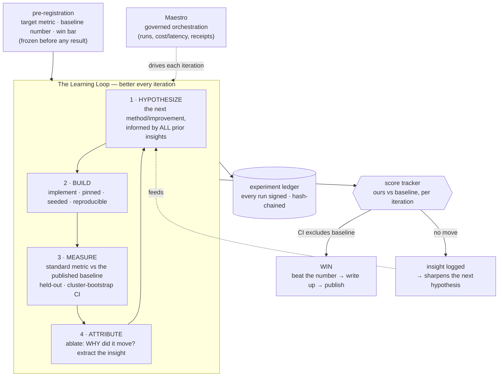

# Frontier Engine — Architecture

**A research engine that gets measurably better every iteration, aimed at one number: beat a
published baseline on a standard public benchmark.**

This is the *engine*. The survey delivers the *target* it runs on (the exact benchmark + the
baseline number to beat). The engine is designed before the target so that the moment the target
locks, we execute with zero improvisation — like a team that built its rig before the race.

The guiding principle, stated as an invariant: **every iteration must either move the score or
produce a logged insight that makes the next iteration more likely to.** No motion without
learning.

---

## 1. Design principles (what makes this world-class, not just a script)

1. **One number, frozen up front.** A single primary metric on a single public benchmark, with a
   pre-registered "win" bar (baseline-beating, CI excludes zero). No goalpost-moving.
2. **Learning is a first-class output.** Each iteration ends with an *attribution* step — an
   ablation that explains *why* the score moved. The insight is the durable asset; the weights are
   disposable.
3. **Reproducible by a stranger, provable by receipts.** Every run is pinned (data hash, code
   version, seed), and every result is hash-chained + signed (Ed25519). A skeptic can verify we
   didn't move the goalpost or cherry-pick a seed.
4. **Cheap-first, scale-last.** Probe the idea at the smallest scale that can falsify it before
   spending GPU. Most ideas die cheap; the survivors earn compute.
5. **Honest by construction.** Nulls are logged and fed forward, not buried. The score tracker
   shows the real trajectory — including the failures that taught us.
6. **Governed orchestration (Maestro).** The iteration loop runs as a governed mission with
   receipts where it genuinely adds value — turning the research campaign into a stress-test of
   Maestro itself (real automation, not a toy), aligned with the broader vision.

---

## 2. The Learning Loop (the heart)



Each box is a contract, not a vibe:

- **HYPOTHESIZE** — a written, falsifiable claim ("adding X should raise the metric by ≥ δ because
  Y"), conditioned on the ledger of prior insights. The hypothesis names its own kill criterion.
- **BUILD** — the smallest faithful implementation; pinned model/data hashes; fixed seed; a
  one-command runner.
- **MEASURE** — the *standard* metric of the field (not a metric we invented), on the official
  split, vs the published baseline, with held-out evaluation and a cluster-bootstrap confidence
  interval. A seed sweep when the effect is small (the P2f→P2g lesson: distributions, not draws).
- **ATTRIBUTE** — an ablation isolating the cause. This is the step most teams skip and the step
  that compounds: it converts a number into knowledge that makes iteration *n+1* smarter than *n*.

---

## 3. The rigor stack (carried over and upgraded from PerceptionProof)

| Layer | What it guarantees |
|---|---|
| Pre-registration | the win bar is frozen before results; no post-hoc goalpost moves |
| Pinning + seeds | byte-identical reproduction; `run_id = hash(data · code · seed)` |
| Cluster-bootstrap CIs + seed sweeps | a "win" is decisive, not a lucky draw |
| Ablations (attribution) | every gain is *explained*, not just observed |
| Ed25519 receipt chain | a stranger can verify the run was not edited or cherry-picked |
| Score tracker | the honest trajectory — our number vs the baseline, every iteration |
| Maestro orchestration | governed runs with cost/latency/receipts; the campaign hardens Maestro |

What's *new* vs PerceptionProof (the "getting better in every aspect"): this engine is built to
**win a number**, not characterize a question — so it adds the score tracker, the attribution
step as a hard gate, the cheap-first escalation ladder, and a tighter build→measure→learn cycle.

---

## 4. Repo shape (instantiated when the target locks)

```
README.md            the mission, the number to beat, the live score trajectory, the loop
PREREGISTRATION.md   target metric, official split, baseline number, win bar (frozen)
docs/ARCHITECTURE.md this engine
engine/              the loop: hypothesize/build/measure/attribute primitives + score tracker
method/              the method under test (filled per target)
experiments/         every iteration: config, result, receipt, ablation, insight
results/             reports + signed receipts + the score-vs-baseline history
```

New repo (not folded into PerceptionProof): this is *method-building to beat a number*, a different
concept from PerceptionProof's *evaluation-validity study*. A clean, single-purpose repo reads as
more serious to the room and keeps each story sharp.

---

## 5. Where Maestro earns its place (used only if it genuinely helps)

The loop is a sequence of governed, receipted steps — exactly Maestro's shape. Concretely: Maestro
orchestrates each iteration's runs (build → train → measure → ablate), records real cost/latency,
signs the receipts, and surfaces the score trajectory. This is not bolted on for show — running a
real, months-long, baseline-chasing research campaign *through* Maestro is a genuine stress test of
the orchestration layer and a proof point for the wider vision: an AI-orchestrated loop that
doesn't just run experiments but *gets better at the problem*. If at any step Maestro adds friction
without value, that step runs direct and we log why — honesty applies to our own tools too.

---

*Status: engine designed. Target (benchmark + exact baseline number) locks when the frontier
survey lands; the repo is then instantiated already-scoped, and iteration 1 begins.*
