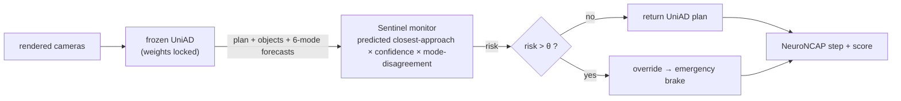

# Iteration 2 — the Sentinel monitor + intervention (pre-registered before measurement)

This is the method. Iterations 1a/1b stood up the closed loop and produced a corpus of **39
frozen-planner collisions / 60 episodes**, where every crash coincides with the planner's own
perception/forecast failing near the ego. Iteration 2 reads that failure *at runtime* and stops the
car. Frozen planner, label-free signal, a brake that plugs in without touching UniAD's weights.

Pinned **before** running the A/B, per the engine (`docs/ARCHITECTURE.md`) and `PREREGISTRATION.md`.

## Hypothesis (H1, the pre-registered win bar)

> A Sentinel-monitored frozen UniAD achieves a **strictly higher mean NeuroNCAP score** and a
> **strictly lower collision rate** than the **same unmonitored frozen UniAD**, on the iter-1b
> collision corpus (frontal/0103, side/0103, stationary/0796), with a drive-clustered bootstrap CI
> on the per-run score delta that **excludes 0**.

Secondary (H1b): the monitor does **no harm** on the non-colliding scene (stationary/0103, already
5.00/0% — Sentinel must not degrade it: a false-brake rate low enough to keep it ≈5.00).

## The signal — introspective, label-free, from the planner's own outputs

`/infer` already returns, in the ego BEV frame, with **no ground truth**:

- `trajectory` — the ego's planned path, 6 waypoints @ 2 Hz (3 s horizon)
- `objects_in_bev` (N × [x,y,w,h,yaw]), `object_scores` (N), `object_classes`
- `future_trajs` — **N agents × 6 modes × 12 steps × [x,y]**: UniAD's own multimodal forecast of
  where each agent is going

Sentinel's runtime **collision-risk** for the current frame:

```
risk = max over agents a, modes m, horizon steps t of
         w(a,m) · proximity( ego_planned(t) , agent_forecast(a,m,t) )
```

- `proximity` rises as the predicted ego–agent gap shrinks below a physical collision margin
  (sum of half-extents + buffer); it is the **predicted closest approach** between the ego's *own*
  plan and the agent's *own* forecast.
- `w(a,m)` weights by detection confidence `object_score(a)` and forecast-mode plausibility, and by
  the **multimodal disagreement** of agent a's 6 modes — the PerceptionProof insight: when the
  planner's own forecast is both *near the ego path* and *internally uncertain*, collision is
  imminent. (PerceptionProof: label-free disagreement predicts the collision gate at AUROC ~0.8.)

No future GT, no privileged sim state — only the frozen planner's published outputs. That is what
makes any gain attributable to Sentinel and what makes the monitor deployable.

## The intervention — a frozen-planner-preserving veto

Inside the inference server, after UniAD produces `(trajectory, aux_outputs)`:

```
if SENTINEL_ENABLED and risk > θ:
    trajectory ← emergency_brake(current_speed)      # decelerate to stop along heading
# else: return UniAD's plan unchanged
```

`emergency_brake` returns a kinematically-decelerating set of waypoints (comfort-bounded), i.e. the
safe fallback the field's runtime monitors use. UniAD's weights are never touched; Sentinel only
**vetoes and brakes** when it predicts the planner is about to crash. θ is the one tunable; it is
fixed on a held-out slice **before** the scoring runs and reported, never tuned on the test scenes.



## A/B protocol (apples-to-apples, no leakage)

1. **Baseline = iter-1b** numbers, monitor OFF (already in hand): frontal/0103 1.07·80%, side/0103
   0.51·100%, stationary/0796 1.03·80%, stationary/0103 5.00·0%.
2. **Treatment** = identical stack, **same scenes, same run count, same seeds**, `SENTINEL_ENABLED=1`.
3. Report per-scene Δscore / Δcollision and the pooled per-run Δ with a **drive-clustered bootstrap
   CI**. H1 holds iff the CI excludes 0 and collisions drop.
4. **θ fixed in advance** on a held-out slice (e.g. a subset of frontal runs) — never on the
   reported scenes. The do-no-harm check on stationary/0103 is mandatory and reported even if it
   hurts us.

## What would falsify / weaken this (stated up front)

- Braking trades collisions for **timeouts / off-route** failures that NeuroNCAP also penalizes →
  score might not rise even if collisions fall. Reported honestly; that is a real negative result.
- If the predicted closest-approach signal does **not** separate colliding from clean frames
  (we will measure its AUROC on the corpus *first*, gate G1), the monitor cannot work and we say so
  before building the intervention.
- A monitor that brakes on everything trivially avoids collisions but destroys the clean scene —
  hence the mandatory do-no-harm gate.

## Build order (cheap-first, gated)

1. **G1 — does the signal see it?** Compute the risk on the existing 60-episode corpus offline (no
   new runs) and measure AUROC of risk vs the known per-run collision outcome. Proceed only if the
   frozen planner's own outputs separate the failures. *(cheapest possible test — pure replay.)*
2. **Monitor module** (`sentinel/monitor.py`) — pure function `(trajectory, aux) → risk`, unit-tested
   on synthetic geometry; wired into `server.py` behind `SENTINEL_ENABLED`.
3. **θ selection** on the held-out slice.
4. **A/B run** on the corpus; bootstrap CI; do-no-harm check.
5. **Attribute** — ablate the signal terms (proximity only vs +confidence vs +disagreement) to learn
   *why* it works (the durable insight), not just that it does.

Status: **pinned, not yet run.** G1 (offline replay AUROC) is next — the cheapest gate, and it
decides whether the intervention is worth building.
